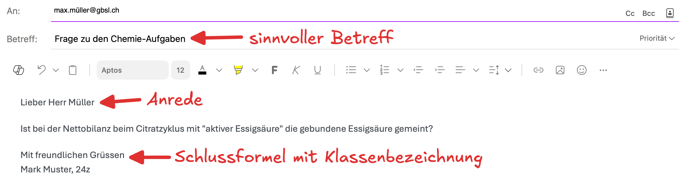

import TabItem from "@theme/TabItem";
import OsTabs from '@tdev-components/OsTabs'
import useBaseUrl from '@docusaurus/useBaseUrl';
import Video from '@tdev-components/Video';
import ProgressState from '@tdev-components/documents/ProgressState';
import { points, multipleChoicePoints } from '@tdev-components/documents/Assessable/helpers/scoring';

# Modul 4: Kommunikation
:::info[Lernziele]
1. Sie können E-Mails und Teams-Nachrichten versenden und dabei alle Aspekte der «Netiquette» korrekt umsetzen.
2. Sie können bei einer E-Mail weitere Empfänger:innen im Cc und im Bcc anfügen und können erklären, was es mit diesen Feldern auf sich hat.
4. Sie können eine Datei per Teams und per Mail an bestimmte Empfänger:innen senden und achten vor dem Versenden auf eine sinnvolle Benennung der Datei. **Achtung:** Bei der Probe werden Sie Ihr Video auch so abgeben müssen!
5. Sie können in Teams einen Audio- oder Videoanruf starten und darin Ihren Bildschirm teilen.
:::

## Netiquette (Teams und E-Mail)
Auf Teams und in E-Mails werden Nachrichten mit **Sorgfalt** geschrieben. Es gehört eine kurze **Anrede** sowie eine **Schlussformel** (oder Grussformel) dazu. In der Schlussformel am Ende der Nachricht halten Sie nebst ihrem Namen auch die **Klassenbezeichnung** fest. Achten Sie zudem auf **angemessene, korrekte Sprache**, inkl. **Gross- und Kleinschreibung**.

> Lieber Herr Müller
>
> Ist bei der Nettobilanz beim Citratzyklus mit "aktiver Essigsäure" die gebundene Essigsäure gemeint?
>
> Mit freundlichen Grüssen\
> Mark Muster, 24z

:::insight[Anrede und Grussformel]
Auch wenn Sie nur eine kurze Frage haben, gehört die Anrede und Schlussformel dazu (es ist **kein WhatsApp-Chat unter Freunden**!).

Im obigen Beispiel sind die beiden Leerzeilen nach der Anrede (`Lieber Herr Müller`) und vor der Schlussformel (`Mit freundlichen Grüssen`) freiwillig. Nach der Anrede sollte aber auf jeden Fall eine neue Zeile beginnen. Auch die Schlussformel und Ihr Name + Klassenbezeichnung sollte **je** auf einer neuen Zeile beginnen, so wie Sie es im Beispiel sehen.

Entwickelt sich durch die Antwort der Lehrperson einen Chat-Charakter (die Lehrperson schreibt innerhalb kurzer Zeit zurück und Sie haben eine Rückfrage zum selben Thema), darf die Anrede und die Schlussformel anschliessend für diese Unterhaltung weggelassen werden. Sobald eine neue Unterhaltung beginnt, braucht es wieder eine Anrede und Schlussformel.
:::

**Zusätzlich bei E-Mails:** Bei E-Mails setzen Sie zudem immer einen passenden **Betreff**. Dieser hilft den Empfänger:innen, die E-Mail schnell zuzuordnen. Der Betreff sollte den Inhalt der E-Mail kurz zusammenfassen.

Eine vollständige, korrekte E-Mail könnte so aussehen:

:::insight[E-Mail ohne Betreff]
Wenn Sie versuchen, eine E-Mail ohne einen Betreff zu versenden, dann klappt das zwar – Outlook wird Sie aber warnen. Zurecht! Im vielleicht sehr vollen Postfach der Empfängerin wird es nämlich sofort unübersichtlich, wenn Mails keinen Betreff enthalten.

**Eine E-Mail ohne Betreff zu versenden gilt als unhöflich.**
:::

## E-Mail
In einer E-Mail gibt es drei verschiedene Arten von Empfänger:innen:

Empfänger:in
: Feld `An:`
: Die Person(en), an die diese E-Mail direkt gerichtet ist. 
Kopie
: Feld `Cc:`
: Die Person(en), die eine Kopie der E-Mail erhalten. Diese Personen sind nicht die Hauptempfänger:innen, aber sie sollen die E-Mail trotzdem erhalten und lesen können.
: Dieses Feld wird genutzt, wenn eine Person zwar nicht an der Unterhaltung beteiligt ist, aber trotzdem über den Inhalt informiert werden soll.
: Nutzen Sie diese Funktion sparsam, um die Empfänger:innen nicht unnötig zu überfluten.
Blindkopie
: Feld `Bcc:`
: Die Person(en), die eine Blindkopie der E-Mail erhalten. Diese Personen solle ebenfalls über die Kommunikation informiert werden, obwohl sie nicht die Hauptempfänger:innen sind.
: Der Unterschied zum Cc-Feld ist, dass die Empfänger:innen **nicht sehen, wer im Bcc-Feld augeführt ist**.
: Das ist besonders nützlich, wenn Sie eine E-Mail an mehrere Personen senden möchten, ohne dass Sie die E-Mail-Adressen aller Empfänger:innen offenlegen möchten (Privatsphäre).

<Video title="Cc- und Bcc-Feld aktivieren" src={useBaseUrl('/img/docs/material/BYOD-Basics-2025/06-Kommunikation/mail_recipients.mov')}/>

<Video title="Dateien per Mail senden" src={useBaseUrl('/img/docs/material/BYOD-Basics-2025/06-Kommunikation/mail_send_files.mov')}>
    **Wichtig:** Achten Sie vor dem Versenden auf eine sinnvolle Benennung der Datei.
</Video>

:::aufgabe[E-Mail senden]
Für diese Übung brauchen Sie drei Kolleg:innen. Sie müssen sich vorher nicht unbedingt mit ihnen absprechen.

<ProgressState id="0e474273-54e1-4215-9bca-5984f7f6cb20">
1. Wählen Sie eine Person __A__ aus, der Sie eine E-Mail schreiben möchten.
2. Verfassen Sie die E-Mail entsprechend der Netiquette.
3. Hängen Sie eine beliebige Datei an, die Sie versenden möchten.
4. Setzen Sie die Person __A__ als Empfänger:in (Feld `An`).
5. Setzen Sie eine zweite Person __B__ ins `Cc`.
6. Setzen Sie eine dritte Person __C__ ins `Bcc`.
7. Schicken Sie die E-Mail ab.
8. Befragen Sie Ihre drei Kolleg:innen:
    - Haben alle die E-Mail erhalten?
    - Sehen Personen __A__ und __B__, dass die E-Mail an sie beide versendet wurde? Sehen Sie wirklich nicht, dass die E-Mail auch an __C__ versendet wurde?
    - Sieht Person __C__, an welche drei Personen (sich selbst eingeschlossen) die E-Mail versendet wurde?
</ProgressState> 
:::

## Teams
<Video title="Dateien per Teams senden" src={useBaseUrl('/img/docs/material/BYOD-Basics-2025/06-Kommunikation/teams_send_files.mov')}>
    **Wichtig:** Achten Sie vor dem Versenden auf eine sinnvolle Benennung der Datei.
</Video>
<Video title="Bildschirm freigeben" src={useBaseUrl('/img/byod-basics/win/ms_teams_share_screen.mp4')}/>
<Video title="Tipp: Benachrichtigungen verwalten" src={useBaseUrl('/img/byod-basics/osx/ms_teams_configure_alerts.mp4')}/>

## Abschlussquiz
<Quiz randomizeQuestions randomizeOptions scoring={points(1)} keepExpanded={"correct"} id="2c316bd0-539a-4b73-86f7-14f566fa6ed0">
    <ChoiceAnswer correct={[1, 4]} multiple scoring={multipleChoicePoints(2, 1, false)}>
        Wählen Sie alle **Teams**-Nachrichten aus, die (für eine neue Unterhaltung) **vollständig** der Netiquette entsprechen.

        1. > Lieber Herr Berger  
           > Könnten Sie noch die Lösungen zum BYOD Modul 4 freischalten?  
           > Liebe Grüsse 
           > Karina Muster (22Gx)
        2. > Liebe Frau Blank 
           > Leider komme ich heute ein paar Minuten später in den Unterricht, weil mein Zug ausgefallen ist. 
           > Liebe Grüsse 
           > Benjamin Beispiel
        3. > Können Sie mir genauer erklären, was mit dem Lernziel Nr. 12 gemeint ist? 
           > Liebe Grüsse 
           > Cecilia, 23Fa
        4. > Guten Abend Frau Grünig 
           > Wäre es möglich, im Unterricht nochmal anzuschauen, wie das mit der for-Schleife funktioniert? 
           > Liebe Grüsse 
           > Tim, 21Ga
        5. > Müssen wir morgen den Laptop mitnehmen? LG
        6. > Lieber Herr Stettler, wann treffen wir uns am Dienstag für die Exkursion? Liebe Grüsse Alex E. (22Fc)
        7. > liebe frau dejenaro 
           > ich habe gemerkt das ich mein handy im zimmer vergessen habe kann ich das heute abholen 
           > leibe grüsse maria 23gn
        8. > Guten Tag Herr Heyen 
           > Könnten wir uns morgen Mittag für eine kurze MA-Besprechung treffen? 
           > Liebe Grüsse, Gion (24Gv)
    </ChoiceAnswer>
    <TrueFalseAnswer correct={false}>
        Bei einer E-Mail kann freiwillig ein Betreff gesetzt werden. Es verstösst aber nicht gegen die Netiquette, wenn man ihn weglässt.
    </TrueFalseAnswer>
    <TrueFalseAnswer correct={true}>
        Wenn ich bei einer E-Mail jemanden ins `Bcc` setze, dann sehen die anderen Empfänger:innen nicht, dass ich die E-Mail auch an diese Person gesendet habe.
    </TrueFalseAnswer>
    <ChoiceAnswer correct={[3]}>
        Angenommen, Sie möchten eine Mail an 120 Personen senden, die sich gegenseitig nicht kennen (z.B. für eine Umfrage für Ihre Maturaarbeit). Aus Datenschutzgründen müssen Sie sicherstellen, dass Sie die E-Mail-Adressen dieser Personen nicht veröffentlichen: Die Empfänger:innen sollen also keine der anderen E-Mail-Adressen sehen können.

        Wie gehen Sie am besten vor?

        1. Ich führe alle Adressen im `An`-Feld auf – die Empfänger:innen sehen nicht, an wen die E-Mail sonst noch ging.
        2. Ich führe alle Adressen im `Cc`-Feld auf – das `C` steht für `Cryptic` und so bleiben die Adressen geheim.
        3. Ich führe alle Adressen im `Bcc`-Feld auf – das `B` steht für `Blind` und so bleiben die Adressen verborgen.
        4. Ich muss vor dem Versenden die Checkbox `Empfänger-Adressen verstecken` auswählen.
        5. Ich muss die Mail 120x einzeln verschicken.
    </ChoiceAnswer>
    <ChoiceAnswer correct={[1]}>
        Wozu braucht man bei einer E-Mail das `Cc`-Feld?

        1. Wenn eine Person zwar nicht an der Unterhaltung beteiligt ist, aber trotzdem über den Inhalt informiert werden soll.
        2. Wenn eine Person nicht sehen können soll, dass man die Nachricht auch noch an andere Personen gesendet hat.
        3. Das `Cc`-Feld war früher nützlich, hat heute aber keine Funktion mehr.
        4. Wenn man auf eine Nachricht Antworten will.
    </ChoiceAnswer>
</Quiz>