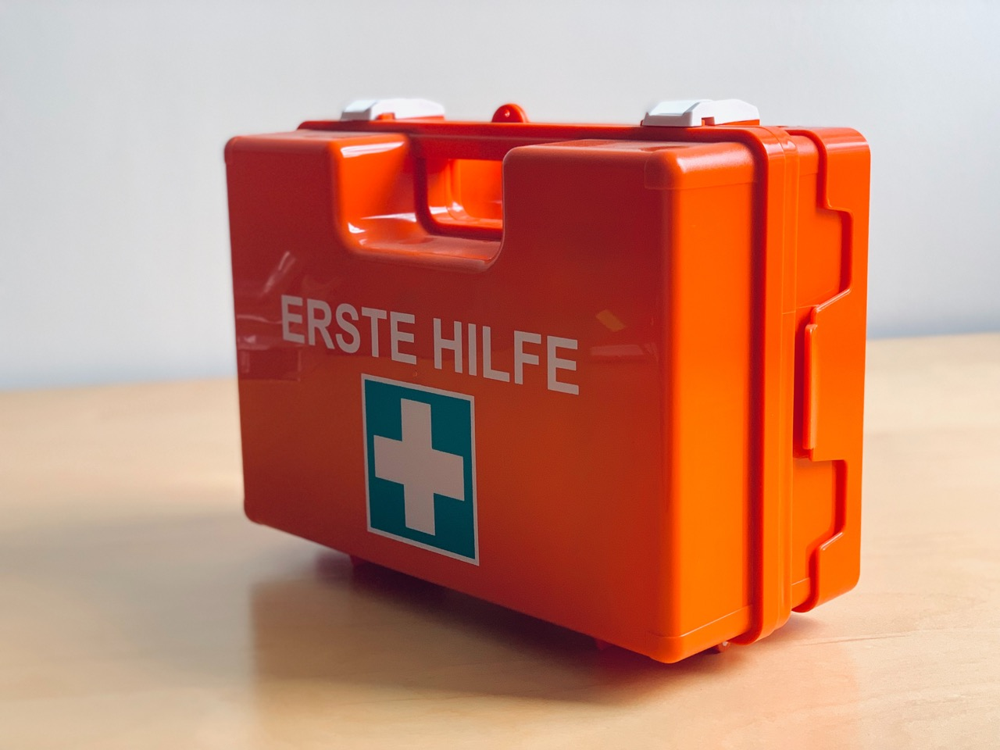

# Erste Hilfe

Bei der Arbeit am Computer treten oft Probleme auf - das gehört zum ganz normalen Alltag. Damit man in solchen Momenten nicht bei der Arbeit blockiert ist, ist es wichtig, dass man sich mit der Zeit gewisse Strategien zur Selbsthilfe aneignet.

:::insight[ICT-Onboarding abgeschlossen?]
In den Sommerferien vor Ihrem Start am Gymnasium wurden Sie dazu aufgefordert, bis zum Schulstart das [ICT-Onboarding](https://ict.gbsl.website/onboarding) vollständig durchzuarbeiten. Damit stellen Sie sicher, dass Ihr Gerät für den Alltag an unserer Schule vorbereitet ist. Falls Sie dies nicht oder nur teilweise erledigt haben, sind IT-Probleme sehr wahrscheinlich.

Vergewissern Sie sich deshalb zuerst, ob Sie das ICT-Onboarding vollständig abgeschlossen haben (alle Fortschrittsanzeigen auf grün), bevor Sie weiter nach einer Lösung suchen.
:::

## Problem analysieren
Sollte also mal etwas nicht funktionieren, sollten Sie das Problem zuerst sorgfältig analysieren. Dazu versuchen Sie, folgende Fragen so präzise wie möglich zu beantworten:

1. Was möchte ich erreichen? Was ist das erwartete Ergebnis?
2. Was passiert (nicht)? Was ist das tatsächliche Ergebnis?
3. Wie unterscheiden sich diese beiden Ergebnisse? Sprich: was genau funktioniert nicht? Inwiefern funktioniert es nicht?

Auf diese Weise erhalten Sie eine konkrete, genaue Problembeschreibung. Diese verwenden Sie anschliessend für alle Lösungsschritte im nächsten Abschnitt.

## Lösung suchen
Jetzt haben Sie eine konkrete Problembeschreibung. Damit können Sie nun die folgenden Lösungsschritte der Reihe nach durcharbeiten:

1. Suchen Sie in Ihren Unterlagen und Referenzen (Classrooms, https://ict.gbsl.website/, etc.) nach Informationen, die Ihnen bei der Lösung des Problems helfen könnten.
2. Recherchieren Sie das Problem mit Google (oder eine Suchmaschine Ihrer Wahl, vgl. [Suchmaschinen](Suchmaschinen)), oder ggf. mit einem KI-Tool (ChatGPT, Claude, etc.).
3. Falls Sie das Problem nicht selbstständig lösen können, wenden Sie sich an eine:n Kolleg:in oder an die Lehrperson. Dabei ist es aber wichtig, dass Sie das Problem möglichst genau beschreiben können. Die Problemanalyse aus dem ersten Abschnitt wird Ihnen dabei behilflich sein.

## IT-Probleme
Probleme mit dem Laptop, Tablet oder Smartphone haben häufig nichts mit dem Informatikunterricht zu tun. Typische Probleme sind beispielsweise:

- Der Laptop lässt sich nicht mehr starten (Bildschirm bleibt schwarz).
- Die Anmeldung bei Microsoft Teams zeigt einen Fehler an.
- Die Verbindung mit dem Schul-WLAN funktioniert nicht richtig.
- ...

Solche Probleme sollten, wenn möglich, immer **ausserhalb der Unterrichtszeit** behoben werden. Die Informatiklehrperson ist **nicht** der IT-Support.

### Ressourcen bei IT-Problemen
Nachdem Sie das IT-Problem präzise analyisert haben (siehe oben), stehen an unserer Schule folgende Hilfe-Ressourcen zur Verfügung:

ICT-Webseite des GBSL
: https://ict.gbsl.website/
: Das ist die **erste** Anlaufstelle für alle IT-Fragen und -Probleme.
: Bevor Sie den IT-Support kontaktieren, sollten Sie immer hier nachschauen, ob es eine Lösung für Ihr Problem gibt.
Support-Adressen
: [https://ict.gbsl.website/support](https://ict.gbsl.website/support)
: Wenn Sie ein IT-Problem nicht selbst lösen können, finden Sie hier eine Übersicht aller relevanten Support-Adressen.
: Dabei sollten Sie die Problemanalyse aus dem ersten Abschnitt verwenden und das Problem **möglichst genau beschreiben**.

---
