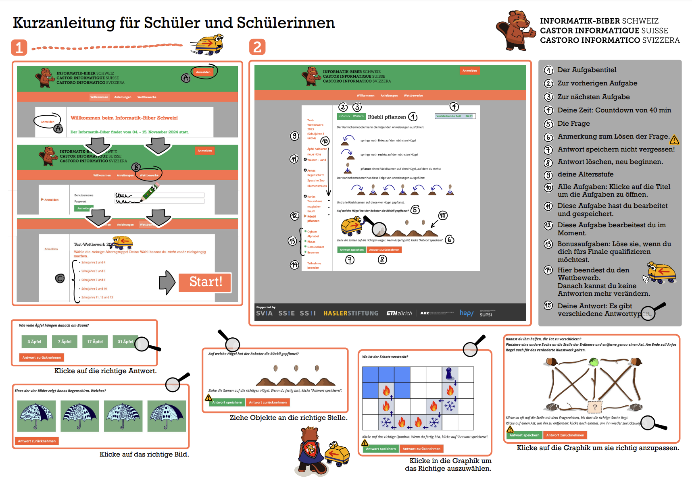

import Restricted from '@tdev-components/documents/Restricted';
import DefinitionList from "@tdev-components/DefinitionList";
import CmsText from '@tdev-components/documents/CmsText';
import WithCmsText from '@tdev-components/documents/CmsText/WithCmsText'
import Steps from '@tdev-components/Steps'

# Informatik-Biber 2026 🦫

Datum 📅
: Einzellektion gemäss Terminplan
Zeitrahmen ⏱️
: 5 Minuten Vorbereitungszeit
: 40 Minuten Zeit für den Wettbewerb
Bewertung ✔
: wird **nicht** mit einer Note bewertet
Ziel 🎯
: sich herausfordern
: sich mit spannenden, besonderen Informatik-Fragen auseinandersetzen

<Restricted id='22d79cc9-1ac1-40d9-82ad-3db4f5597396'>
  ## Vorbereitung am Wettbewerbstag
  Für die Durchführung des Wettbewerbs haben Sie **40 Minuten** Zeit. Die Vorbereitung zu Beginn der Lektion muss also möglichst zügig ablaufen, damit Sie rechtzeitig in die Pause gehen können.
  <Steps>
    1. Zimmer einrichten wie für eine Probe (Tische in Reihen anordnen)
    2. Laptop einschalten und **diese Seite wieder öffnen**, auf der Sie sich **jetzt gerade befinden**.
  </Steps>

  ## Übungstest
  <Steps>
    1. Den obigen Abschnitt [Vorbereitung am Wettbewerbstag](#vorbereitung-am-wettbewerbstag) vollständig durchlesen
    2. Folgende Seiten vollständig durchlesen:
       1. [Aufgaben bearbeiten (1)](https://www.informatik-biber.ch/support/deu/manual_sus/aufgaben-bearbeiten-kurzanleitung/)
       2. [Aufgaben bearbeiten (2)](https://www.informatik-biber.ch/support/deu/manual_sus/aufgaben-bearbeiten-was-du-noch-wissen-musst/)
       3. [Punktvergabe](https://www.informatik-biber.ch/support/deu/manual_sus/punktvergabe/)
    3. Beim [Test-Wettbewerb](https://wettbewerb.informatik-biber.ch/index.php?action=anon_join&grp_id=453) so viele Fragen beantworten wie möglich
  </Steps>
</Restricted>

<Restricted id='119b7b70-3545-43fb-a46f-334369293723'>
  ## Wettbewerb
    <WithCmsText entries={{
        'username': 'd47dff96-d8a2-49a5-aa70-97261c376e9b',
        'password': '98bd8164-e2da-4319-9185-0649d8ea7348'}}>
      <DefinitionList>
        <dt>Username</dt>
        <dd><CmsText name='username'/></dd>
        <dt>Passwort</dt>
        <dd><CmsText name='password'/></dd>
      </DefinitionList>
    </WithCmsText>

  <Steps>
    1. [https://wettbewerb.informatik-biber.ch/](https://wettbewerb.informatik-biber.ch/) öffnen
    2. Mit den obigen Zugangsdaten einloggen
    3. Altersgruppe auswählen (es sollte nur eine Option geben)
    4. Auf __Start__ klicken (**keine:n Team-Partner:in anmelden**)
    5. Nochmal auf __Start__ klicken
    6. So viele Fragen wie möglich bearbeiten (siehe [Kurzanleitung](#kurzanleitung) unten)
  </Steps>

  Viel Spass und viel Erfolg! 🍀🥳
</Restricted>

# Kurzanleitung

