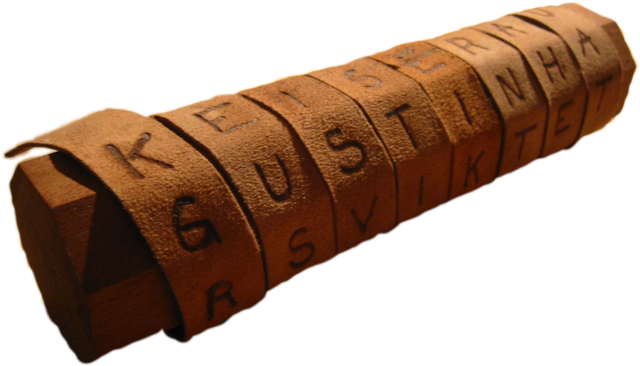

---
sidebar_custom_props:
  source:
    name: rothe.io
    ref: 'https://rothe.io/?b=crypto&p=818731'
page_id: 89a6dc52-174a-4a26-9c96-8ce3cb149b63
---

import Skytale from "@tdev-components/visualization-tools/cryptology/Skytale";

# Skytale
Um ca. 500 v. Chr. nutzten die Spartaner eine **Skytale** (altgriech.: σκυτάλη skytálē, _Stock_, _Stab), um wichtige militärische Botschaften zu übermitteln. Das [Verschlüsselungsverfahren](../01-Grundbegriffe.mdx#die-begriffe-der-kryptographie) bestand darin, dass der Absender einen Streifen aus Pergament oder Leder spiralförmig um die Skytale wickelte und die Nachricht längs des Stabes auf das aufgewickelte Band schrieb. Auf dem abgewickelten Streifen, der dem Empfänger übermittelt wurde, stand nun eine scheinbar sinnlose Buchstabenfolge. Als [Entschlüsselungsverfahren](../01-Grundbegriffe.mdx#die-begriffe-der-kryptographie) wickelte der Empfänger die Botschaft um eine Skytale vom selben Durchmesser und konnte die Nachricht damit wieder entziffern.

## Transposition
Die Skytale ist ein Beispiel einer Verschlüsselung durch Transposition. Das heisst, dass die Zeichen des Geheimtextes nicht ersetzt, sondern nur umgestellt (*transponiert*) werden.

## Skytale ausprobieren
:::aufgabe[Skytale ausprobieren]
<TaskState id="05d6b880-88d0-4e2f-a027-b5520060cfb9" />
Probieren Sie die Skytale aus: Verschlüsseln Sie beispielsweise mal Ihren eigenen Namen.

Was passiert, wenn Sie den Schlüssel dann von 2 auf 3, 4, 5, ... anpassen? Halten Sie Ihre Beobachtungen hier fest.
<QuillV2 id="952bd941-0c65-4e34-8884-38e901170f03" />

<Solution id="af7a4f1f-5ac4-40c1-a57b-757e7ec9606a">
  Der Schlüssel entspricht der Anzahl Kanten der Skytale. Setzen wir den Schlüssel auf $1$, haben wir keine Verschlüsselung. Setzen wir ihn auf die Länge des Klartextes, können wir den Klartext vertikal ablesen.
</Solution>
:::

<Skytale />
