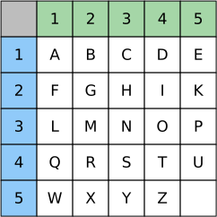
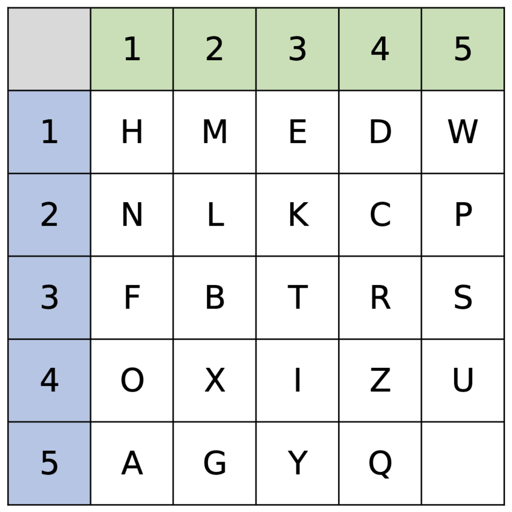

---
sidebar_custom_props:
  source:
    name: rothe.io
    ref: 'https://rothe.io/?b=crypto&p=423844'
page_id: a2b8513e-b1f6-4bf7-b2c6-bb53ffb2dc82
---

import Polybios from "@tdev-components/visualization-tools/cryptology/Polybios";

# Polybios-Chiffre

Die **Polybios-Chiffre** wurde vom griechischen Geschichtsschreiber Polybios (200 v. Chr. bis 120 v. Chr.) entwickelt.

Bei der Polybios-Verschlüsselung wird zunächst ein Quadrat mit den Buchstaben des Alphabets gefüllt. Das Resultat bezeichnen wir als **Polybios-Quadrat** (oder **Polybios-Matrix**). Polybios hat das griechische Alphabet mit 24 Buchstaben verwendet. Übertragen auf das lateinische Alphabet sieht dies folgendermassen aus:

Die beiden Buchstaben `J` und `V` finden keinen Platz in der Tabelle. `J` wird mit `I` zusammengefasst, `V` mit `U`.

Die Zeilen und Spalten im Quadrat werden durchnummeriert. Nun kann ein Buchstabe _verschlüsselt_ werden, indem seine Zeilen- und Spaltennummer aufgeschrieben wird.

:::insight[Beispiel]
So wird der Klartext `HALLO` zum Geheimtext `23 11 31 31 34`.
:::

Zur _Entschlüsselung_ werden diese Zahlen wiederum als Zeilen- und Spaltennummern im _Polybios-Quadrat_ interpretiert und so durch die Buchstaben in den entsprechenden Zellen ersetzt.

Die Anordnung der Buchstaben innerhalb eines _Polybios-Quadrats_ kann grundsätzlich beliebig gewählt werden. Die gewählte Anordnung ist dann der [geheime Schlüssel](../01-Grundbegriffe.mdx#die-begriffe-der-kryptographie).

## Polybios ausprobieren
:::info[Was ist der Schlüssel?]
Die Anordnung des Alphabets innerhalb eines _Polybios-Quadrats_ kann beliebig gewählt werden und bildet den geheimen Schlüssel. In dieser Simulation verwenden wir als Schlüssel einfachheitshalber die sequentielle Anordnung (`A` - `Z`, ohne `J` und `V`) wie sie in der obigen Abbildung gezeigt wird.
:::

<Polybios />

## Übungen
::::aufgabe[Polybios ver- und entschlüsseln]
<TaskState id="23f4b1ec-54b6-4b89-b1b6-bad092b4c9e3" />
Vervollständigen Sie die untenstehende Tabelle, indem Sie die Klartexteinträge mit der Polybios-Chiffre ver-, respektive entschlüsseln.

Verwenden Sie dazu folgendes Polybios-Quadrat:

:::warning[Von Hand rechnen]
Das obige Tool können Sie dazu nicht verwenden, da dort ein anderes Polybios-Quadrat verwendet wird.
:::

Achten Sie auf Grossschreibung und Leerzeichen. Kontrollieren Sie Ihre Lösungen mit den :mdi[help-circle-outline]-Buttons.

| Klartext                                                                    | Geheimtext                                                                                          |
|-----------------------------------------------------------------------------|-----------------------------------------------------------------------------------------------------|
| HALLO                                                                       | <String solution="11 51 22 22 41" id="04d5b46f-bece-4cd5-b6d8-17142ece8318" />                      |
| <String solution="KRYPTO" id="edc35807-b1ef-4ca4-a286-6e6574dca429" />      | 23 34 53 25 33 41                                                                                   |
| TREFFPUNKT                                                                  | <String solution="33 34 13 31 31 25 45 21 23 33" id="d317e9d7-2b2d-4c94-9b2a-7d7e112c44e7" />       |
| <String solution="MISSISSIPPI" id="3a940e3b-cc46-4283-8b94-d6072b7f5284" /> | 12 43 35 35 43 35 35 43 25 25 43                                                                    |
| GRIECHENLAND                                                                | <String solution="52 34 43 13 24 11 13 21 22 51 21 14" id="1da217fc-9439-4c96-bd05-c908c38b281b" /> |

::::
