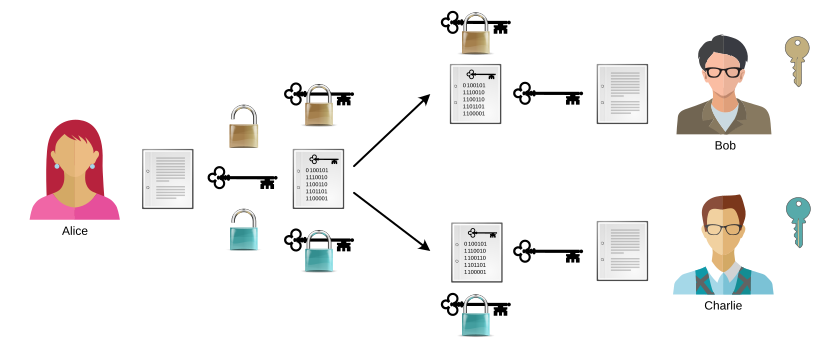
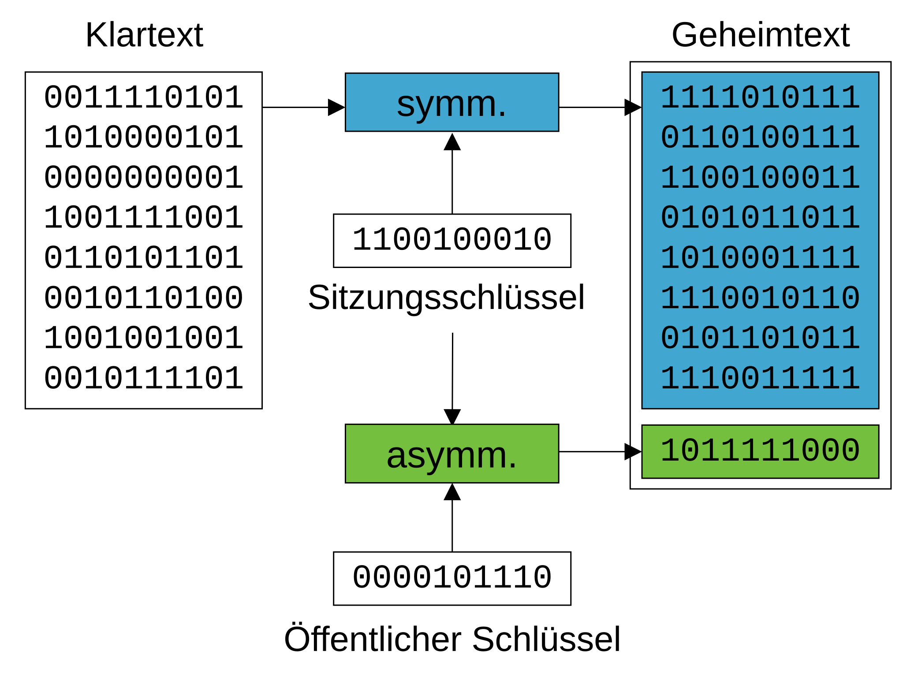
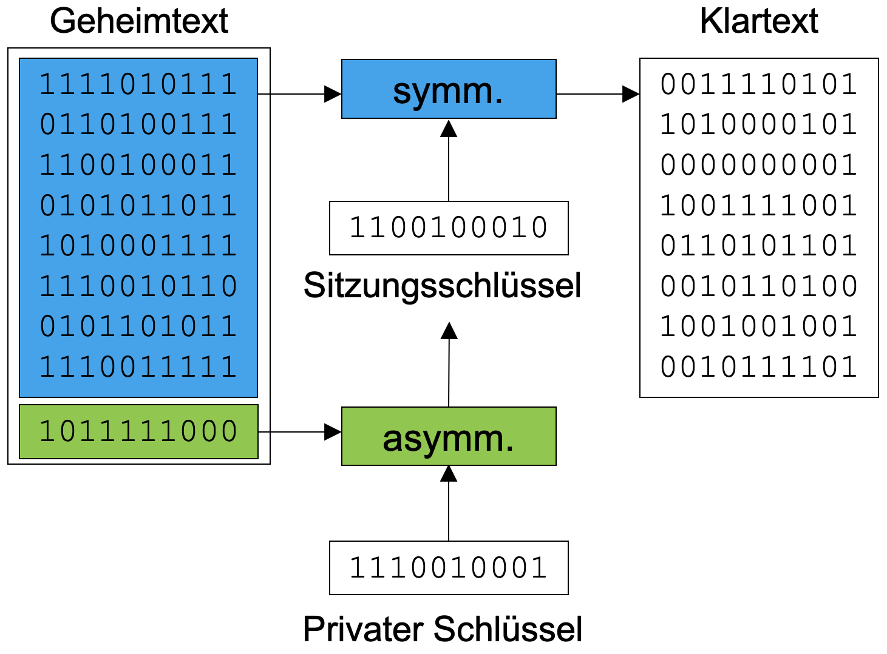

---
sidebar_custom_props:
  id: 19d66cdc-04d7-4c11-8ccb-cf1b1de165fa
  source:
    name: rothe.io
    ref: 'https://rothe.io/?b=crypto&p=559732'
page_id: 0ccad24b-8b2a-41a3-8948-a2f3d2a4f98f
---

import { points, multipleChoicePoints } from '@tdev-components/documents/Assessable/helpers/scoring';

# Kombinierte Verfahren

## Vergleich symmetrischer und asymmetrischer Verschlüsselung
Wir haben in der letzten Aufgabe gesehen, dass asymmetrische Verschlüsselung auch Nachteile hat. Wir wollen die Vor- und Nachteile einander gegenüberstellen.

| Symmetrische Verschlüsselung     | Asymmetrische Verschlüsselung |
|:---------------------------------|:------------------------------|
| ✔ sehr schnell                   | ✘ ~ 1'000x langsamer          |
| ✔ 1 Nachricht für alle           | ✘ 1 Nachricht pro Person      |
| ✘ geheimen Schlüssel austauschen | ✔ Public Key ist öffentlich   |
| → nur 1 gemeinsamer Schlüssel    | → 1 Schlüsselpaar pro Person  |

## Beide Verfahren kombinieren
In kryptographischen Verfahren, die heutzutage eingesetzt werden, ist das Ziel, die Vorteile beider Verfahren zu nutzen und die Nachteile zu eliminieren. Daher werden zur Verschlüsselung von Daten beide Verfahren eingesetzt:

## Symmetrische Verfahren zur Verschlüsselung der Daten
Da asymmetrische Verfahren ca. 1'000x langsamer sind als symmetrische Verfahren, werden zur Verschlüsselung der Daten symmetrische Verfahren eingesetzt. Denn kryptographische Verfahren werden nicht nur zur Verschlüsselung kurzer Nachrichten (wie z.B. Textnachrichten) eingesetzt, häufig müssen auch grosse Datenmengen (z.B. hochauflösende Bilder, Tondokumente, Videos, ...) verschlüsselt werden, folglich spielt die Geschwindigkeit eine zentrale Rolle.

Zudem ist bei symmetrischer Verschlüsselung praktisch, dass die Daten für sämtliche Empfänger gleich verschlüsselt sind und somit
- nicht mehrmals verschlüsselt werden müssen (Zeitbedarf) und
- in derselben Nachricht an alle Empfänger verschickt werden können, ohne dass die Nachricht unnötig ein Mehrfaches ihrer ursprünglichen Länge erreicht (Platzbedarf).

## Asymmetrische Verfahren zur sicheren Schlüsselübertragung
Asymmetrische Verfahren sind langsamer, aber zur **Verschlüsselung des symmetrischen Schlüssels** perfekt geeignet, da dieser sehr kurz ist und im Vergleich zu den Daten Geschwindigkeit keine Rolle spielt.

Zudem ist auch der verschlüsselte symmetrische Schlüssel sehr kurz, so dass die Nachricht nur unwesentlich länger wird, wenn diese für mehrere Personen verfasst wird.

## Zusätzlicher Vorteil
Der symmetrische Schlüssel kann so vom Computer gewählt werden. Dies hat zwei Vorteile:

1. Der Schlüssel ist wirklich zufällig und gleichverteilt im gesamten Schlüsselraum (ein Passwort, das von einer Person gewählt wird, schafft dies nicht).
2. Der Schlüssel kann für jede Nachricht neu gewählt werden. Somit erhält jede Nachricht einen eigenen Schlüssel.

Man spricht daher von einem **Sitzungsschlüssel** (engl. session key) für die symmetrische Verschlüsselung. Die folgende Übersicht stellt prinzipiell dasselbe dar wie die Abbildung oben, allerdings mit einem anderem Fokus.

:::key[Auch symmetrische Verfahren sind sicher!]
Asymmetrische Verfahren sind also nicht besser als symmetrische! Sie erfüllen einen anderen Zweck und werden gleichzeitig mit symmetrischen Verfahren eingesetzt. Symmetrische Verfahren sind also nicht unsicher, einzig die Erstellung des Schlüssels und der Schlüsselaustausch sind ein Problem.
:::

:::aufgabe[Kombinierte Entschlüsselung]
<TaskState id="a54c8e8a-18c2-4ea6-9c16-44f803e488d8" />
Stellen Sie dar, wie die Umkehrung – also die **Ent**schlüsselung – funktioniert, wenn symmetrische und asymmetrische Verfahren kombiniert verwendet werden. Sie können diese Aufgabe auf Papier bearbeiten.

<Solution id="3a6fd1fc-783b-460f-a0a8-3dc62634a6fd">

</Solution>
:::

## Quiz
<Quiz randomizeQuestions randomizeOptions scoring={points(1)} keepExpanded={'correct'} resetMode='incorrect' id='d22d6235-27b3-4ff1-a1ac-88864c0e6b8b'>
    <TrueFalseAnswer correct={false}>
      Symmetrische Verfahren weniger sicher als asymmetrische Verfahren.

      <Hint when="correct">
        Genau, das stimmt nicht. Symmetrische Verfahren haben zwar den Nachteil, dass man zuerst einen geheimen Schlüssel austauschen muss. Kryptographisch gesehen ist ein gutes symmetrisches Verfahren aber (mindestens) genauso schwer zu knacken, wie ein gutes asymmetrisches.
      </Hint>
    </TrueFalseAnswer>
    <ChoiceAnswer correct={[3]}>
      Wie kann man das kombinierte Verfahren (symmetrisch + asymmetrisch) am besten beschreiben?

      1. Der Klartext wird zuerst symmetrisch und dann nochmal asymmetrisch verschlüsselt.
      2. Der Klartext wird zuerst asymmetrisch und dann nochmal symmetrisch verschlüsselt.
      3. Der Klartext wird symmetrisch verschlüsselt. Der dazugehörige geheime Schlüssel wird asymmetrisch verschlüsselt (mit dem öffentlichen Schlüssel des Empfängers).
      4. Der Klartext wird mit dem öffentlichen Schlüssel des Empfängers symmetrisch verschlüsselt.

      <Hint when="correct">
        Richtig. Der geheime Schlüssel ist (im Vergleich zum Klartext) meistens relativ kurz und lässt sich problemlos asymmetrisch verschlüsseln. Für den Klartext können wir derweil ein effizienteres, symmetrisches Verfahren verwenden. Einen Schlüsselaustausch brauchen wir trotzdem nicht, weil wir den geheimen Schlüssel (für die symmetrische Verschlüsselung) mit dem öffentlichen Schlüssel der Empfängerin asymmetrisch verschlüsseln.
      </Hint>
      <Hint when={["incorrect", "partially_correct"]}>
        Bei kombinierten Verfahren möchte man die Vorteile der symmetrischen und asymmetrischen Verschlüsselung kombinieren und die jeweiligen Nachteile so gut wie möglich umgehen.
      </Hint>
    </ChoiceAnswer>
    <ChoiceAnswer correct={[1]}>
      Wie bezeichnet man bei der asymmetrischen Verschlüsselung denjenigen Schlüssel, den man niemandem weitergibt?

      1. privater Schlüssel
      2. öffentlicher Schlüssel
      3. geheimer Schlüssel
      4. kryptischer Schlüssel

      <Hint when={['correct']}>
        Super!

        symmetrisch
        : **geheimer** Schlüssel
        asymmetrisch
        : **privater** und **öffentlicher** Schlüssel
      </Hint>
    </ChoiceAnswer>
    <ChoiceAnswer multiple correct={[1, 3, 4]} scoring={multipleChoicePoints(2, 1, false)}>
      Welche Aussagen über die asymmetrische Verschlüsselung sind korrekt?

      1. Sie ist deutlich langsamer als die symmetrische (ca. 1000x).
      2. Sie ist moderner und deshalb besser.
      3. Der öffentliche Schlüssel darf beliebig verteilt werden – z.B. darf ich meinen öffentlichen Schlüssel problemlos in meine Instagram-Bio schreiben.
      4. Wenn ich eine Nachricht asymmetrisch verschlüsselt an 5 verschiedene Personen senden will, dann muss ich sie 5x separat verschlüsseln.
      5. Asymmetrische Verfahren können nur für Text verwendet werden. Für andere Daten wie Bilder, Videos, etc. funktionieren sie nicht.

      <Hint when={['correct']}>
        Sehr gut! Asymmetrische Verfahren sind deutlich langsamer und Nachrichten müssen mehrfach separat verschlüsselt werden, wenn sie an mehrere Empfänger:innen gesendet werden sollen. Asymmetrische Verfahren können aber grundsätzlich trotzdem für alle Arten von Daten verwendet werden. Den öffentlichen Schlüssel darf man beliebig verteilen – er ist kein Geheimnis. Dennoch sind asymmetrische Verfahren nicht einfach strikt besser als symmetrische. Sie haben Vor- und Nachteile.
      </Hint>
    </ChoiceAnswer>
</Quiz>