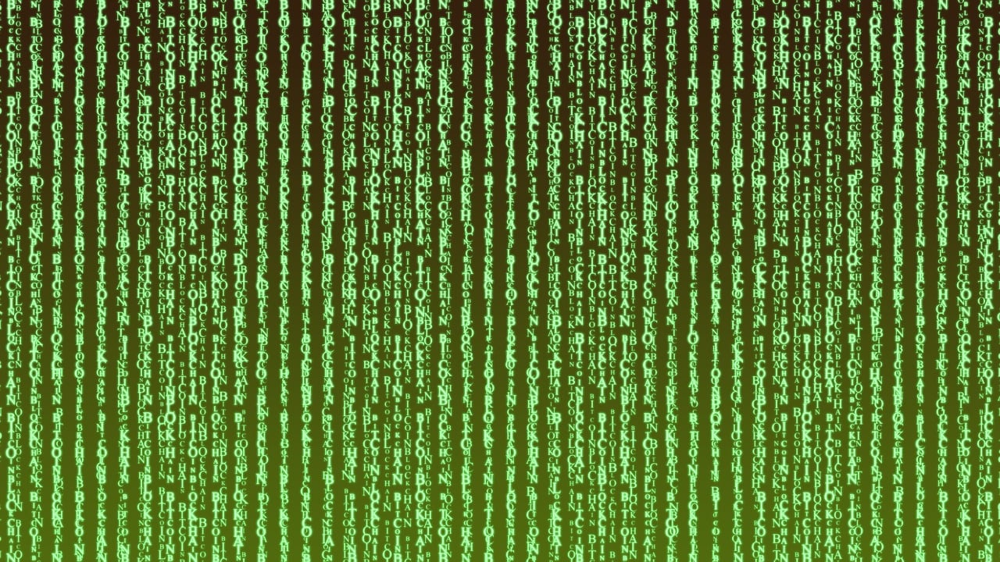

import DefinitionList from "@tdev-components/DefinitionList";
import CmsText from '@tdev-components/documents/CmsText';
import WithCmsText from '@tdev-components/documents/CmsText/WithCmsText';
import SlidesLink from '@tdev-components/LinkButton/SlidesLink';

# Kryptologie

## Unterrichtsfolien
<SlidesLink url="https://erzbe-my.sharepoint.com/:f:/g/personal/silas_berger_gbsl_ch/IgAfWF1jm2NsSo9SubQ-UnouAY575u1OxVYNkrOUu_P0hNg?e=qLxBgh" />

## Probe
<DefinitionList>
  <dt>Dauer</dt>
  <dd>ca. 45-60 Minuten</dd>

  <dt>Wertung</dt>
  <dd>Die Note zählt voll</dd>

  <dt>Modus</dt>
  <dd>Es wird noch bekanntgegeben, ob die Probe am Computer oder auf Papier stattfindet.</dd>

  <dt>Hilfsmittel</dt>
  <dd>Zusammenfassung (1 Blatt A4, **einseitig**, **handschriftlich**, **persönlich** erstellt)</dd>
  <dd>Taschenrechner erlaubt</dd>

  <WithCmsText entries={{note: "9686cf9b-a31b-47ae-919e-26c117823d08", punkte: "5812348e-c266-4284-bf94-3e06e18e1c64"}}>
    <dt>Note</dt>
    <dd>__<CmsText name="note" />__ (<CmsText name="punkte" />/?? Punkten)</dd>
  </WithCmsText>
</DefinitionList>

:::info[Prüfungsstoff]
Die Lernziele werden noch bekanntgegeben.
:::
‚