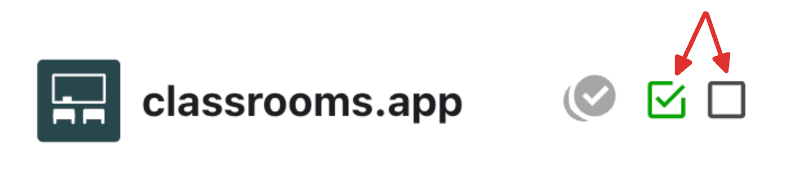
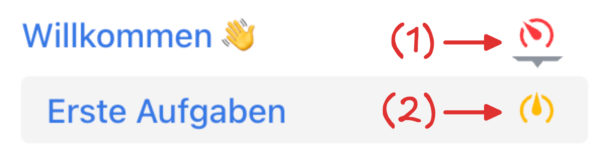
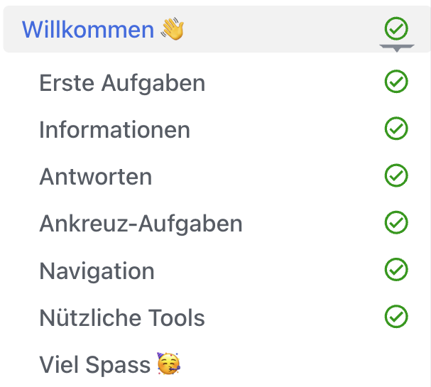

import ProgressState from '@tdev-components/documents/ProgressState';

# Erste Aufgaben
Um _Classrooms_ besser kennenzulernen, finden Sie hier eine Reihe von kurzen Einführungsaufgaben.

## Eine erste Aufgabe
:::aufgabe[Wie sehen Aufgaben aus?]
<TaskState id="2de704f5-132a-4139-8f6e-cba9fa3b0bed" />
Wenn eine Kachel so aussieht, wie diese hier, dann handelt es sich um eine Aufgabe. Eine erste Aufgabe haben Sie auf der vorherigen Seite bereits erledigt.

Mit der **Checkbox** oben links können Sie Ihren **Arbeitsstand** angeben. Meistens können Sie aus drei Zuständen auswählen:

:mdi[checkbox-blank-outline]
: **Offen**
: _«Ich habe die Aufgabe noch nicht erledigt.»_
:mdi[checkbox-marked-outline]{.green}
: **Erledigt**
: _«Ich habe die Aufgabe erledigt.»_
:mdi[account-question-outline]{.orange}
: **Frage**
: _«Ich brauche Hilfe von der Lehrperson.»_
: Wenn Sie während des Unterrichts eine Frage haben, melden Sie sich trotzdem bei der Lehrperson!

Am oberen Rand der Webseite sehen Sie einen Überblick über Ihren Arbeitsstand bei allen Aufgaben auf der aktuellen Seite:

**Tipp:** Sie können oben auf die jeweilige Checkbox klicken, um direkt zur entsprechenden Aufgabe zu springen.

Wenn Sie alles durchgelesen und verstanden haben, klicken Sie die Checkbox jetzt ein paarmal an, um jeden Zustand einmal zu sehen. Sehen Sie, wie sich der Zustand auch in der Übersicht am oberen Seitenrand verändert?

Setzen Sie die Checkbox am Schluss auf **Erledigt**, um die Aufgabe als abgeschlossen zu markieren.
:::

:::warning[Arbeitsstand immer aktualisieren]
Es wird erwartet, dass Sie **erledigte Aufgaben zuverlässig als erledigt markieren**. So kann die Lehrperson Ihren Arbeitsstand im Unterricht verfolgen und Ihnen gezielt helfen, wenn Sie bei einer Aufgabe nicht weiterkommen.

**Es gilt: Eine Aufgabe ist erst dann erledigt, wenn Sie sie als erledigt markiert haben!**
:::

## Fortschritt anzeigen
Währen Sie am oberen Seitenrand den Fortschritt über die individuellen Aufgaben auf dieser Seite sehen, finden Sie links in der Navigationsleiste eine Fortschrittsanzeige über alle Aufgaben.

Vermutlich sieht die bei Ihnen aktuell so aus:

1
: Die Fortschrittsanzeige ist auf rot, obwohl auf auf der __Willkommen 👋__-Seite bereits alle Aufgaben erledigt wurden.
: Der Grund: Das ist eine Seite mit Unterkapiteln (z.B. __Erste Aufgabe__, wo Sie sich gerade befinden), und da hat es noch offene Aufgaben.
2
: Die Fortschrittsanzeige ist auf gelb, weil auf der Seite __Erste Aufgabe__ bereits mindestens eine Aufgabe erledigt wurde, aber noch nicht alle.

Die Fortschrittsanzeige in der Navigationsleiste zeigt also immer den Fortschritt über alle Aufgaben auf der aktuellen Seite **und allen Unterseiten** an. Sobald Sie mit dieser Einführung fertig sind, und alles erledigt haben, wird die Anzeige bei der __Willkommen 👋__-Seite auf grün stehen.

:::aufgabe[Fortschritt anzeigen]
<TaskState id="cdd608a1-23f2-4955-b433-ede6276922d4" />
Markieren Sie diese Aufgabe als erledigt und beobachten Sie, wie die Fortschrittsanzeige für die __Erste Aufgabe__-Seite auf ein grünes Gutzeichen wechselt.
:::

:::insight[Einführung abschliessen]
Sobald Sie diese Einführung abgeschlossen haben, sollte es in Ihrer Navigationsleiste wie folgt aussehen:

Wenn Sie also zuoberst bei der Überschrift __Willkommen 👋__ ein grünes Gutzeichen haben, dann wissen Sie, dass Sie alles erledigt haben.
:::

## Fertig?
Haben Sie alle Aufgaben erledigt? Ist die Fortschrittsanzeige für die aktuelle Seite auf grün?

Dann klicken Sie jetzt auf __Weiter__, um zur nächsten Seite zu gelangen.
