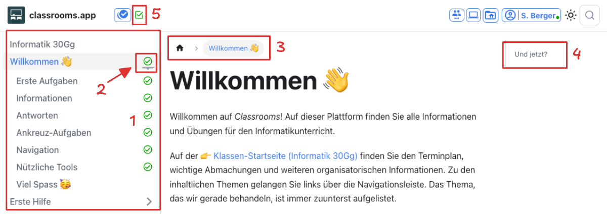
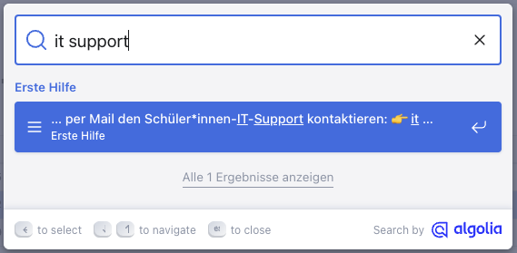

import PageReadCheck from '@tdev/page-read-check/PageReadCheck';
import Quiz from "@tdev-components/documents/Assessable/Quiz"
import ChoiceAnswer from "@tdev-components/documents/Assessable/ChoiceAnswer"
import TrueFalseAnswer from "@tdev-components/documents/Assessable/TrueFalseAnswer"

# Navigation
Um sich auf _Classrooms_ zu bewegen, haben Sie folgende Möglichkeiten:

**1**
: _Navigationsleiste_
: Hier finden Sie alle Themen und Artikel für den Unterricht.
**2**
: _Thema aufklappen_
: Dieser Pfeil bedeutet, dass es sich hier um ein Thema mit mehreren Artikeln handelt.
**3**
: _Breadcrumbs_
: Die Breadcrumbs (dt.: _Brotkrümel_) zeigen an, wo wir uns gerade befinden (der sogenannte _Pfad_ der aktuellen Seite). Mit diesen Knöpfen kann man auch navigieren.
: Im obigen Bild befinden wir uns im Artikel __Erste Aufgaben__ im Thema __Willkommen 👋__.
**4**
: _Inhaltsverzeichnis_
: Das Inhaltsverzeichnis der aktuellen Seite, mit allen Überschriften.
: Mit einem Klick auf eine Überschrift springen Sie zum entsprechenden Kapitel.
**5**
: _Aufgabenübersicht_
: Übersicht über den Arbeitsstand in diesem Artikel.
: Mit einem Klick auf das jeweilige Symbol springen Sie zur entsprechenden Aufgabe.

Zudem finden Sie ganz zuunterst jeweils zwei Knöpfe __Vorwärts__ und __Zurück__, mit denen Sie zum nächsten oder zum vorherigen Artikel wechseln können.

## Suche
Oben rechts finden Sie eine Suchfunktion, mit der Sie das ganze Classrooms durchsuchen können:

:::cards

::br

:::

:::aufgabe[Suchen]
Nutzen Sie jetzt die Suchfunktion, um herauszufinden, wie Sie bei IT-Problemen vorgehen müssen. Suchen Sie dazu in der Classrooms-Suche nach __IT-Probleme__, wählen Sie ein passendes Suchergebnis aus, und lesen Sie die ganze gefundene Seite sorgfältig durch.

Danach können Sie das folgende Quiz bearbeiten:

<Quiz id="b82a1450-e446-4a8a-b395-62b82eb40a96">
    <TrueFalseAnswer correct={false} title="Erster Schritt?">
        Wenn ich ein IT-Problem habe, dann wende ich mich als erstes an den IT-Support.
    </TrueFalseAnswer>

    <ChoiceAnswer correct={[3]} title="IT-Support">
        Wie lautet die E-Mail-Adresse des IT-Supports für Schüler:innen?

        1. [it-support-fuer-schuelerinnen@gbsl.ch](#)
        2. [ITSupport@gbsl.ch](#)
        3. [ITHelp@bernedu.ch](#)
        4. [servicedesk@edubern.ch](#)
    </ChoiceAnswer>

    <ChoiceAnswer multiple correct={[1, 4, 5]} title="Was stimmt?">
        Wählen Sie alle korrekten Aussagen an.

        1. Wenn ich bei der Lösung eines Problems Hilfe brauche, muss ich das Problem zuerst sorgfältig analysieren und genau beschreiben können.
        2. Die Informatiklehrperson ist mein IT-Support.
        3. IT-Probleme sollten möglichst während Unterrichtszeit gelöst werden.
        4. Eine Liste der relevanten Support-Adressen finden Sie auf [https://ict.gbsl.website/support](https://ict.gbsl.website/support).
        5. Wenn ich das ICT-Onboarding noch nicht vollständig abgeschlossen habe, ist das ein möglicher Grund für mein Problem.
        6. IT-Probleme sind aussergewöhnlich und treten normalerweise nicht im normalen Alltag auf.
    </ChoiceAnswer>
</Quiz>

:::

## Fussleiste
Die Fussleiste von Classrooms bietet Ihnen einige nützliche Links für Ihren Schulalltag. Scrollen Sie mal ganz nach unten und schauen Sie sich um!

<ChoiceAnswer multiple correct={[2, 3, 5]} id="9acbb33c-a1c0-42ca-9742-98d76fc7c18f" randomizeOptions>
    Was für Links haben Sie dort (unter anderem) gefunden? Kreuzen Sie alle korrekten Antworten an.

    1. Lösungen zu den Aufgaben
    2. Stundenplan
    3. Passwort zurücksetzen
    4. E-Mail-Verzeichnis aller Lehrpersonen
    5. Mensa-Menu
</ChoiceAnswer>
