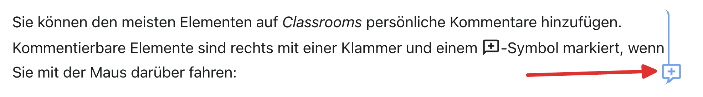
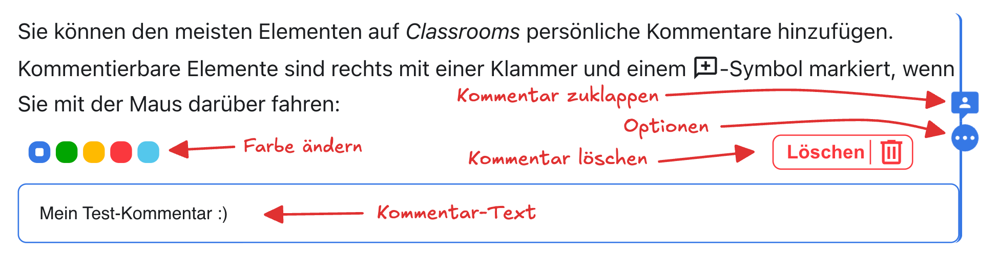

# Nützliche Tools
Sie kennen nun bereits die wichtigsten Funktionen von Classrooms. Hier finden Sie noch ein paar weitere nützliche Tools, die Ihnen auf dieser Plattform zur Verfügung stehen.

## Kommentare
Sie können den meisten Elementen auf _Classrooms_ persönliche Kommentare hinzufügen. Kommentierbare Elemente sind rechts mit einer Klammer und einem :mdi[message-plus-outline]-Symbol markiert, wenn Sie mit der Maus darüber fahren:

Klicken Sie auf das :mdi[message-plus-outline]-Symbol, um einen Kommentar zu erstellen.

Sie können den Kommentar wieder zuklappen, damit er nicht mehr im Weg ist. Mit einem Klick auf die drei Punkte können Sie zudem die Farbe anpassen und den Kommentar löschen:

Ihre Kommentare sind nur für Sie und die Lehrperson sichtbar. Sie können Ihnen beispielsweise dabei helfen, Erkenntnisse direkt im Unterrichtsmaterial festzuhalten oder Lernziele farblich zu markieren, die Sie noch nicht verstehen oder die Sie noch üben möchten.

:::aufgabe[Kommentar erstellen]
<TaskState id="808a21f8-ab6e-4a49-83b8-f6f934c364df" />
Probieren Sie es gleich aus! Erstellen Sie für diesen Absatz hier einen Kommentar und markieren Sie die Aufgabe anschliessend als erledigt.
:::

## Persönlicher Bereich
In Ihrem persönlichen Bereich haben Sie Platz für Notizen, Skizzen und Code-Ausschnitte. Alles, was Sie in Ihren persönlichen Bereich erstellen, ist nur für Sie und die Lehrperson sichtbar.

::video[./img/personal-space.mp4]{controls=true autoplay=true loop=true muted=true}
