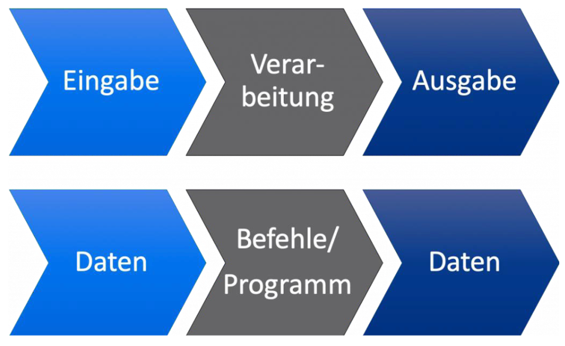
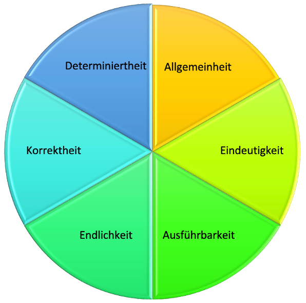
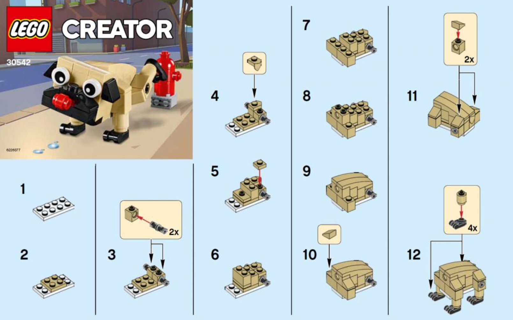
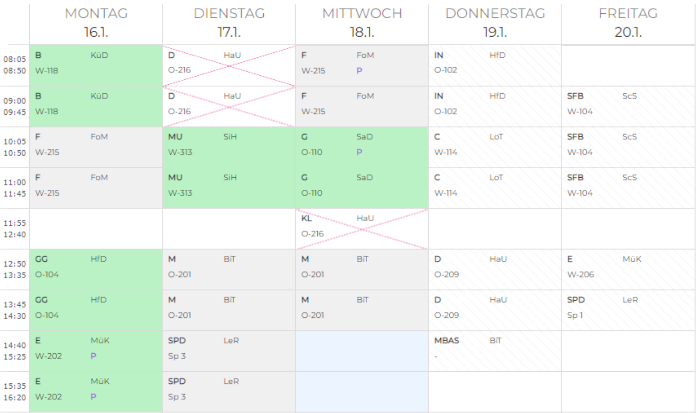
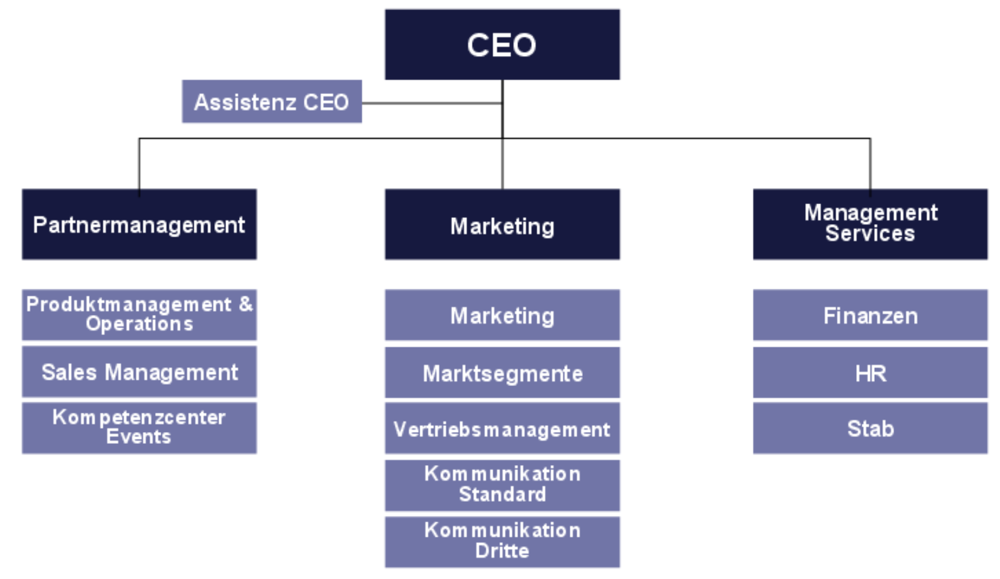
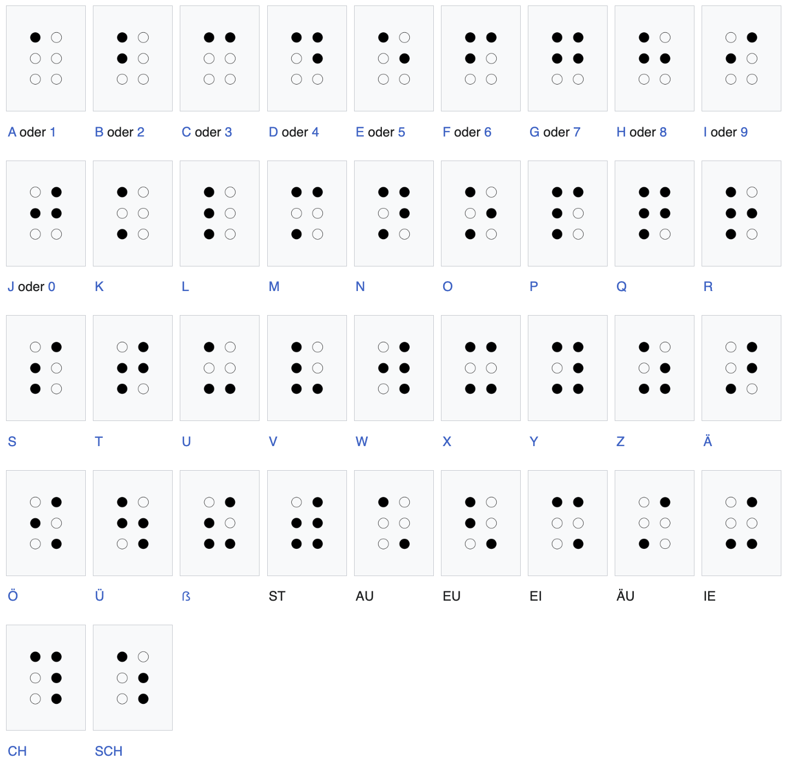
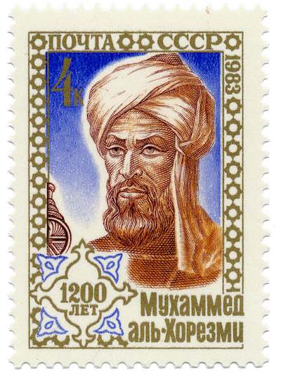

import Restricted from '@tdev-components/documents/Restricted';

# Algorithmus

## Definition
> «Ein Algorithmus beschreibt die Methode, mit der eine Aufgabe gelöst wird. Ein Algorithmus besteht aus einer Folge von Schritten, deren korrekte Abarbeitung die gestellte Aufgabe löst. Die Abarbeitung oder den Vorgang selbst bezeichnet man als Prozeß.»
> 
> Les Goldschlager/Andrew Lister: _Informatik_, 1984

Damit wir von einem Algorithmus sprechen, müssen also **zwei** Bedingungen erfüllt sein:
1. Es muss eine **Schritt-für-Schritt-Anleitung** vorliegen.
2. Diese Schritt-für-Schritt-Anleitung muss eine **Aufgabe oder ein Problem lösen**.

Die folgende Tabelle zeigt ein paar Beispiele von Prozessen mit zugehörigem Algorithmus:

| Prozess             | Algorithmus   | Typischer Schritt                 |
| :------------------ | :------------ | :-------------------------------- |
| Kranich falten      | [Faltanleitung](./01-Faltanleitung.mdx) | Papier entlang einer Linie falten |
| Möbel zusammenbauen | [Bauanleitung](./02-Bauanleitung.mdx) | Schraube anziehen |
| Musikstück spielen  | [Notenblatt](./03-Notenblatt.mdx) | Ein `c'` spielen |

## EVA
Algorithmen folgen dem Grundprinzip der Informatik: **EVA** (Eingabe, Verarbeitung, Ausgabe). Dabei wird eine **Eingabe** verarbeitet und es entsteht eine **Ausgabe**. Die Verarbeitung erfolgt in mehreren **Schritten**, die nacheinander abgearbeitet werden.

## Anforderungen
Wir können Algorithmen auf verschiedenen Anforderungen hin prüfen:

| Anforderung | Beschreibung | Erklärung / Beispiel |
|-|-|-|
| **Allgemeinheit** | Es soll nicht nur ein einzelnes Problem gelöst werden. | Ein Addier-Algorithmus nicht nur 7 + 4 addieren können, sondern zwei beliebige natürliche Zahlen. |
| **Eindeutigkeit** | Die Abfolge der einzelnen Schritte soll genau festgelegt sein. Es soll zu jedem Zeitpunkt klar sein, welcher Schritt als nächstes ausgeführt werden muss. | Ein Algorithmus sollte keine Angaben machen wie «jetzt könnte man beispielsweise…» |
| **Ausführbarkeit** | Man (respektive, ein Prozessor) muss jeden Einzelschritt des Algorithmus auch wirklich ausführen können. | Ein Algorithmus sollte keine Schritte enthalten, die nicht ausführbar sind, wie z.B. «den Himmel berühren». |
| **Endlichkeit** | Ein Algorithmus soll immer nach einer endlichen Anzahl Schritte zu einer Lösung kommen und auch nur endlich viel Platz auf dem Computer beanspruchen. | Benötigt er unendlich lange, erhält man nie ein Ergebnis. Benötigt er unendlich viel Platz, kann ihn kein Computer der Welt speichern und ausführen. |
| **Korrektheit** | Ein Algorithmus soll für alle möglichen (erlaubten) Eingaben zu einer korrekten Lösung kommen. | Ein Sortier-Algorithmus sollte immer die Elemente in der richtigen Reihenfolge sortieren. |
| **Determiniertheit** | Ein Algorithmus soll mit den gleichen Eingabewerten immer zur gleichen Ausgabe kommen. Es sollte keinen Zufallsfaktor geben. | Die Quadratwurzel aus 49 muss immer 7 geben. |

:::insight[Welche Anforderungen sind wichtig?]
Diese Anforderungen entscheiden **nicht**, ob es sich um einen Algorithmus handelt oder nicht. Wir nutzen sie, um **Algorithmen zu beschreiben**.

In der Praxis erfüllen Algorithmen nicht zwingend alle Anforderungen:
- **Eindeutigkeit**, **Ausführbarkeit**, **Endlichkeit** und **Korrektheit** sollten immer erfüllt sein, damit wir einen _brauchbaren_ Algorithmus haben.
- **Determiniertheit** ist generell wünschenswert, allerdings **nicht immer** zwingend notwendig, und manchmal sogar unerwünscht.
- **Allgemeinheit** ist eine wünschenswerte Eigenschaft, aber grundsätzlich nicht zwingend notwendig.
:::

## Übungen
Gehen Sie bei jeder der folgenden Aufgaben wie folgt for:

<Steps>
1. Überlegen Sie sich, ob es sich hier um einen Algorithmus handelt, oder nicht. Notieren und **begründen** Sie Ihre Antwort in ersten der beiden Textfelder.
2. Basierend auf Ihrer Entscheidung…
   1. Wenn es sich um einen **Algorithmus** handelt, analysieren Sie nun, welche der sechs Kriterien hier erfüllt sind und welche nicht. Begründen Sie jeweils kurz. Halten Sie Ihre Antwort im zweiten Textfeld fest.
   2. Wenn es **kein Algorithmus** ist, dann können Sie den zweiten Teil der Aufgabe überspringen. Die sechs Kriterien lassen sich nur auf Algorithmen anwenden.
</Steps>

:::info[Annahmen]
Manchmal müssen Sie gewisse Annahmen treffen, um eine Antwort geben zu können. Halten Sie diese Annahmen jeweils in Ihrer Antwort fest!
:::

### Aufgabe 1
:::aufgabe[Lego-Anleitung]
<TaskState id="b116a808-dea2-40cc-af91-6e51b5ed3570" />

Handelt es sich hier um einen Algorithmus? Wieso (nicht)?
<QuillV2 id="2d7454ca-8987-495b-b013-ade88cb329be" />

Sofern es sich um einen Algorithmus handelt: Welche der sechs Anforderungen sind erfüllt? Begründen Sie.
<QuillV2 id="bf7cece8-061e-48bd-8b7a-0b0153317011" />
:::

### Aufgabe 2
:::aufgabe[Zeitungsartikel]
<TaskState id="ea5bd3ac-0fee-4e98-80ab-497f7f37aaca" />

Handelt es sich hier um einen Algorithmus? Wieso (nicht)?
<QuillV2 id="9966c7c8-b782-4d76-adb2-dc13b3b04b19" />

Sofern es sich um einen Algorithmus handelt: Welche der sechs Anforderungen sind erfüllt? Begründen Sie.
<QuillV2 id="762feb2a-403b-4ccc-814d-e4a95989ad5c" />
:::

### Aufgabe 3
:::aufgabe[Stundenplan]
<TaskState id="4082cb6d-30fd-4176-959e-e815bd68f80c" />

Handelt es sich hier um einen Algorithmus? Wieso (nicht)?
<QuillV2 id="1cc508cb-afa3-4eaf-91ef-66209149406e" />

Sofern es sich um einen Algorithmus handelt: Welche der sechs Anforderungen sind erfüllt? Begründen Sie.
<QuillV2 id="528fcba3-9863-4df0-ac56-ee62e955eee6" />
:::

### Aufgabe 4
:::aufgabe[Organigramm]
<TaskState id="3fc4ce4d-7a33-4f90-8a4f-8e848cb15607" />

Handelt es sich hier um einen Algorithmus? Wieso (nicht)?
<QuillV2 id="d2bbc724-3fc3-4c1a-8552-54696b3d1074" />

Sofern es sich um einen Algorithmus handelt: Welche der sechs Anforderungen sind erfüllt? Begründen Sie.
<QuillV2 id="6de09c1c-ecb5-4fe7-adbd-2b8aaed6c497" />
:::

### Aufgabe 5
:::aufgabe[Knotensammlung]
<TaskState id="dc25499e-9fbd-4b9f-9c72-1eedf94e46ac" />

Handelt es sich hier um einen Algorithmus? Wieso (nicht)?
<QuillV2 id="6d872eea-2786-421e-9f21-005710a76515" />

Sofern es sich um einen Algorithmus handelt: Welche der sechs Anforderungen sind erfüllt? Begründen Sie.
<QuillV2 id="e0a4561c-c3ad-4d44-bac0-7c511ad86b95" />
:::

### Aufgabe 6
:::aufgabe[Hände richtig waschen]
<TaskState id="ad947d23-3ae5-413b-979c-076ff84413bd" />

Handelt es sich hier um einen Algorithmus? Wieso (nicht)?
<QuillV2 id="746c33b5-7142-4f91-87d3-dbf231a1da0d" />

Sofern es sich um einen Algorithmus handelt: Welche der sechs Anforderungen sind erfüllt? Begründen Sie.
<QuillV2 id="d30c4abd-16c6-4386-be88-eef69a607199" />
:::

### Aufgabe 7
:::aufgabe[Wegbeschreibung]
<TaskState id="4fe7ec1b-eb5a-4e51-bdc9-fdeb00409845" />

Eine Wegbeschreibung:
> Start: Ländtestrasse 12, Biel, Gebäude D, Ausgang Strasse \
> schräg rechts zur Ampel \
> Zebrastreifen überqueren, dem Weg für 130m folgen \
> Rechts abbiegen auf Dammweg / Aarbergstrasse \
> Dem Weg bis zum Parkplatz folgen \
> Treppe heruntergehen \
> Zebrastreifen überqueren \
> Parkplatz überqueren \
> Ziel: Bahnhof Biel \

Handelt es sich hier um einen Algorithmus? Wieso (nicht)?
<QuillV2 id="5f4ad527-bf74-4896-8423-a902442cd880" />

Sofern es sich um einen Algorithmus handelt: Welche der sechs Anforderungen sind erfüllt? Begründen Sie.
<QuillV2 id="8e791313-7665-4b99-a842-fdb061045947" />
:::

### Aufgabe 8
:::aufgabe[Wegbeschreibung]
<TaskState id="9bca208d-fb05-469d-b390-d08627cf2cce" />

Handelt es sich hier um einen Algorithmus? Wieso (nicht)?
<QuillV2 id="b84ed2b1-b6b6-44fd-86dc-b805684ca2d9" />

Sofern es sich um einen Algorithmus handelt: Welche der sechs Anforderungen sind erfüllt? Begründen Sie.
<QuillV2 id="0a928bff-a0f7-4962-b3b1-28864d370fc0" />
:::

### Abschlussquiz
:::aufgabe[Abschlussquiz]
<Quiz keepExpanded={"correct"} randomizeOptions id="ea52fac4-20c9-4351-879d-14413820324e">
  <TrueFalseAnswer correct={true}>
    Ein Algorithmus ist eine Schritt-für-Schritt Anleitung, die ein Problem oder eine Aufgabe löst.
  </TrueFalseAnswer>
  <ChoiceAnswer multiple correct={[2, 3, 4]}>
    Kreuzen Sie alle korrekten Aussagen an.

    1. Wenn etwas nicht endlich oder nicht eindeutig ist, dann ist es kein Algorithmus.
    2. Dass ein Algorithmus das Kriterium der _Allgemeinheit_ erfüllt, ist zwar wünschenswert, aber nicht zwingend.
    3. Ein Algorithmus, der nicht endlich ist, ist meistens nicht sinnvoll.
    4. _Determiniertheit_ bedeutet, dass ein Algorithmus für eine gleiche Eingabe immer die gleiche Ausgabe (das gleiche Ergebnis) produziert.
    5. Algorithmen sind vor allem am **E**-Teil (Eingabe) und **A**-Teil (Ausgabe) des **EVA**-Prinzips beteiligt.
  </ChoiceAnswer>
  <ChoiceAnswer correct={[4]}>
    Über welches Kriterium wird in diesem Zitat gesprochen?

    > Nach Schritt 3 ist nicht ganz klar, ob danach zuerst die Rückwand oder die Seitenwände anschrauben muss.

    1. Ausführbarkeit
    2. Determiniertheit
    3. Korrektheit
    4. Eindeutigkeit 
    5. Endlichkeit
    6. Allgemeinheit
  </ChoiceAnswer>
  <TrueFalseAnswer correct={false}>
    Wenn ein Algorithmus das Kriterium der _Korrektheit_ erfüllt, dann führt er für jede erdenkliche Eingabe zu einem korrekten Ergebnis.
  </TrueFalseAnswer>
</Quiz>
:::

## ⭐️ Al-Chwarizmi
Abu Dschaʿfar Muhammad ibn Musa al-Chwārizmī war ein Mathematiker und Universalgelehrter. Er stammte zwar aus dem iranischen Choresmien, verbrachte jedoch den größten Teil seines Lebens in Bagdad und war dort im «Haus der Weisheit», einer Art Akademie, tätig.

Al-Chwarizmi gilt als einer der bedeutendsten Mathematiker, da er sich mit Algebra als elementarer Untersuchungsform beschäftigte.[^1]

In der lateinischen Übersetzung eines Werkes von Al-Chwarizmi wurde sein Name als «algorismus» geschrieben. Davon leitet sich der heutige Begriff «Algorithmus» ab.[^2]

[^1]: Quelle: [Wikipedia: al-Chwarizmi](https://de.wikipedia.org/wiki/Al-Chwarizmi)
[^2]: Quelle: [Wiktionary: Algorithmus](https://de.wiktionary.org/wiki/Algorithmus)
