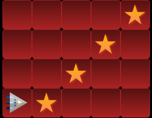
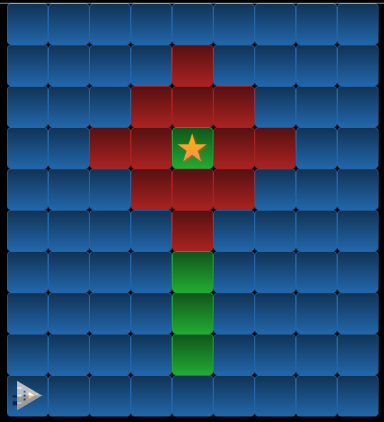
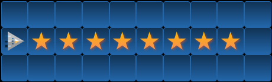
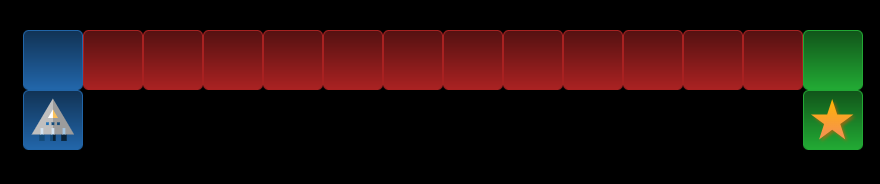
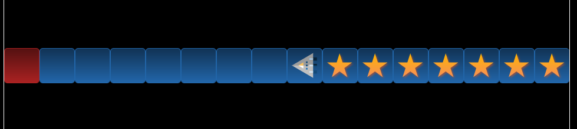
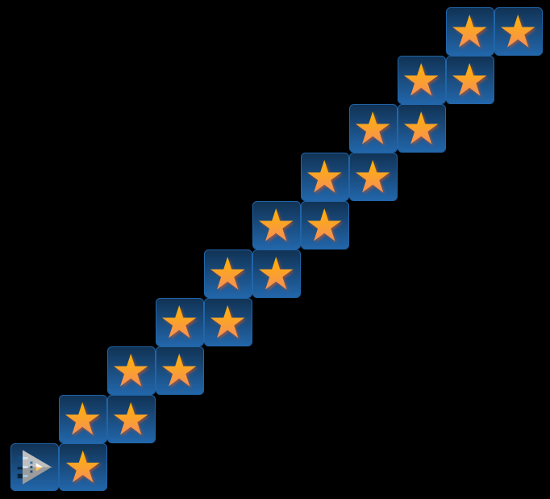
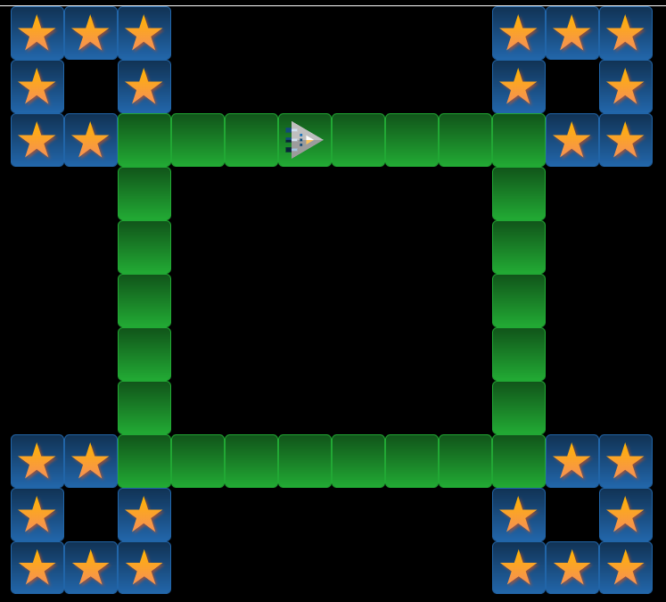
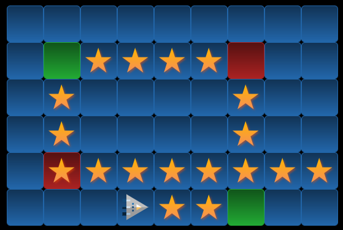
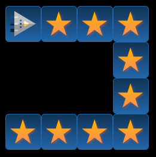
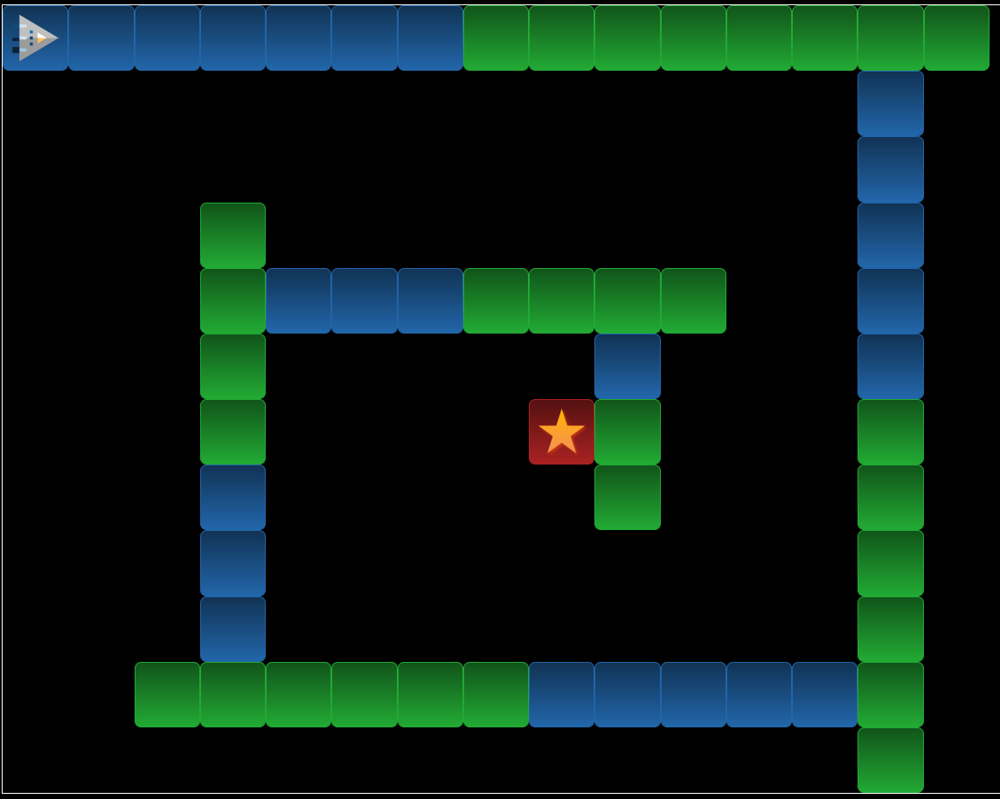

# ⭐️ RoboZZle
Mit algorithmischem Denken können die folgenden RoboZZles (Kunstwort aus **Robo**ter + Pu**zzle**) gelöst werden.

## Tutorial
[Beispiel 1a](https://alexanderson1993.github.io/robozzle-react/?level=-1)
::video[./img/robozzle-tutorial.mp4]{height=500px muted autoplay loop controls=false}

:::info[Mn, F1, F2,...]
Die Abkürzungen __Mn__, __F1__, __F2__ usw. stehen für die Namen der Unterprogramme - sie geben also einer __Sequenz__ einen Namen, über welche diese aufgerufen werden kann!

__Mn__ ist dabei die Abkürzung für "Main" und steht für das Hauptprogramm, welches beim Klick auf Start ausgeführt wird.
:::

:::tip
Es müssen nicht immer alle Felder eines Unterprogramms ausgefüllt werden. In diesem Fall wird das Unterprogramm nur mit den Feldern aufgerufen, die es auch hat.
:::

## Aufgaben
Klicken Sie auf den Link ganz oben in jeder Aufgabe, um das entsprechende Puzzle zu spielen. Machen Sie ein Screenshot Ihrer Lösung und fügen Sie es im Lösungs-Textfeld ein.

### Puzzle 1
:::aufgabe[Robozzle 1]
  <TaskState id="56943252-0056-48e8-9283-7ad490a73c65" />

  [Puzzle 1](https://alexanderson1993.github.io/robozzle-react/?level=14288)

  

  <QuillV2 id="f9911c60-8141-4111-8a28-caafd65db1fa" />
:::

### Puzzle 2
:::aufgabe[Robozzle 2]
  <TaskState id="aa7dc016-c291-47bf-a3db-bc82be05e5a1" />

  [Puzzle 2](https://alexanderson1993.github.io/robozzle-react/?level=14737)

  
  
  <QuillV2 id="23ad62a6-968f-490d-aa7e-05a2bf5c3919" />
:::

### Puzzle 3
:::aufgabe[Robozzle 3]
  <TaskState id="d5d49361-8d8c-4d9e-baa6-b5912cc50c3a" />

  [Puzzle 3](https://alexanderson1993.github.io/robozzle-react/?level=14261)

  
  
  <QuillV2 id="316a8c2d-bbfb-4743-a028-d4c7d4e4dd54" />
:::

### Puzzle 4
:::aufgabe[Robozzle 4]
  <TaskState id="695e0003-ebfe-40a9-94bb-0e80c3dee9ac" />

  [Puzzle 4](https://alexanderson1993.github.io/robozzle-react/?level=-3)

  
  
  <QuillV2 id="516e13b2-2c5a-41b3-90e2-0eae16e25aff" />
:::

### Puzzle 5
:::aufgabe[Robozzle 5]
  <TaskState id="6f7cfb83-c53f-4253-84bf-adf6a18d2873" />

  [Puzzle 5](https://alexanderson1993.github.io/robozzle-react/?level=105)

  
  
  <QuillV2 id="a738907c-1d21-4c8e-9f28-79d45c8fbc53" />
:::

### Puzzle 6
:::aufgabe[Robozzle 6]
  <TaskState id="4084fbfe-9f6d-40ae-a1e0-a24dd78a759c" />

  [Puzzle 6](https://alexanderson1993.github.io/robozzle-react/?level=140)

  
  
  <QuillV2 id="5da608d0-0088-442a-b36a-d6bc736974cf" />
:::

### Puzzle 7
:::aufgabe[Robozzle 7]
  <TaskState id="709e396e-6293-4734-a148-87e80c40d210" />

  [Puzzle 7](https://alexanderson1993.github.io/robozzle-react/?level=27)

  
  
  <QuillV2 id="ccd0421d-9dd7-4afa-a821-7230602e3168" />
:::

### Puzzle 8
:::aufgabe[Robozzle 8]
  <TaskState id="3a777124-cd37-4b91-98ab-5b7d069eddf6" />

  [Puzzle 8](https://alexanderson1993.github.io/robozzle-react/?level=15093)

  
  
  <QuillV2 id="bc6f68c9-66a9-407a-9bcb-39dc1d3b80ea" />
:::

### Puzzle 9
:::aufgabe[Robozzle 9]
  <TaskState id="71f74315-a9ed-455e-ad77-6cd1bc0b75f6" />

  [Puzzle 9](https://alexanderson1993.github.io/robozzle-react/?level=12986)

  
  
  <QuillV2 id="d9fe10d9-78d8-4dd5-baf6-712c35477439" />
:::

### Puzzle 10
:::aufgabe[Robozzle 10]
  <TaskState id="52b55bbb-a7de-4b32-b187-eb1764704ece" />

  [Puzzle 10](https://alexanderson1993.github.io/robozzle-react/?level=16166)

  
  
  <QuillV2 id="a1ea6d8a-645c-4aa7-94fc-b1234497c627" />
:::

### Puzzle 11
:::aufgabe[Mein RoboZZle]
<TaskState id="b024c565-4369-41f2-bb5a-3b4200a3f4d9" />

Suchen Sie sich selber ein spannendes RoboZZle aus und lösen Sie dies. Halten Sie neben der Lösung und dem Link zum Rätsel auch kurz fest, was Sie an diesem RoboZZle besonders interessant fanden.

<QuillV2 id="2962269f-14e3-4249-8695-7c27fbbc27ac" />
:::

### Puzzle 12
:::aufgabe[Robozzle 87]
  <TaskState id="533f4dfa-f8ee-4792-8bcf-9676acb07db2" />

  [Puzzle 12](https://alexanderson1993.github.io/robozzle-react/?level=87)

  
  
  <QuillV2 id="e38aef5c-8406-4253-90b9-8aee04f33628" />
:::
