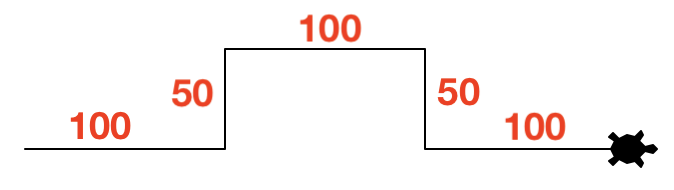
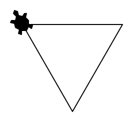
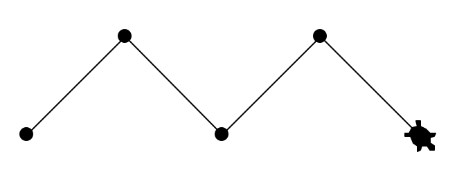
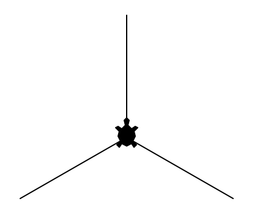
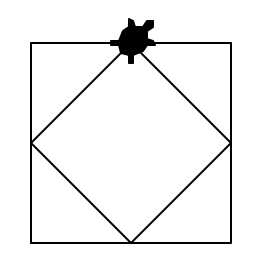
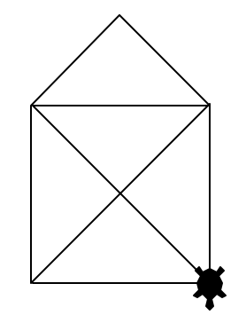
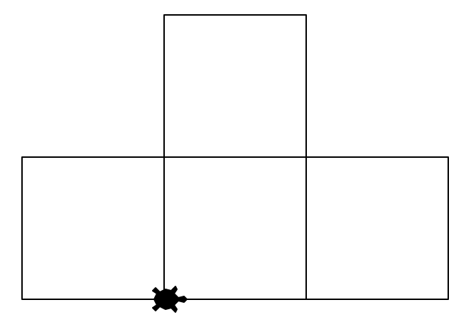

# Turtle bewegen
Jetzt können Sie selber aktiv werden und Ihre ersten Turtle-Zeichnungen erstellen!

## Aufgaben
:::aufgabe[aufgabe_1.py]
<TaskState id='3d91e16f-90a3-48c1-a2b2-a709d9b52529'/>
Schreiben Sie ein Turtle-Programm, das folgende Figur mit den angegebenen Längen zeichnet (die Längenangaben müssen Sie natürlich nicht mitzeichnen 😉):



```py live_py id=226d5c5f-fef5-42b8-bcb0-c264f6294e50
```

<Solution id='f618ae09-f6e0-4e97-a618-5f97406623d4'>
  ```py live_py readonly slim
  from turtle import *

  shape('turtle')

  forward(100)
  left(90)
  forward(50)
  right(90)
  forward(100)
  right(90)
  forward(50)
  left(90)
  forward(100)

  done()
  ```
</Solution>
:::

:::aufgabe[aufgabe_2.py]
<TaskState id='88c8d918-7fed-4814-83a4-d0dc7cfc4db4'/>
Erstellen Sie ein Turtle-Programm, das ein gleichseitiges Dreieck mit einer Seitenlänge von $100$ zeichnet. Finden Sie den korrekten Drehwinkel heraus?



```py live_py id=2d1c6568-1af3-4a53-891e-aca615a405d8
```

<Solution id='1f1f35ef-2901-4188-b411-bdd75e88a8d2'>
  ```py live_py readonly slim
  from turtle import *

  shape('turtle')

  forward(100)
  right(120)
  forward(100)
  right(120)
  forward(100)

  done()
  ```
</Solution>
:::

::::aufgabe[aufgabe_3.py]
<TaskState id='490bd451-ecda-49c4-8a4f-96661cf31833'/>
Erstellen Sie ein Turtle-Programm, das diese Zeichnung erstellt (Strichlänge `100`):



:::tip[Hinweis]
Verwenden Sie den Befehl `dot(d)` um einen Punkt mit dem Durchmesser `d` zu zeichnen.
:::

```py live_py id=f5e8fed4-f3a6-4e41-b60f-fc7b042adc32
```

<Solution id='ffb437fb-91b5-4f9b-adde-4dd071ad170d'>
  ```py live_py readonly slim
  from turtle import *

  shape('turtle')

  dot(10)
  left(45)
  forward(100)
  dot(10)
  right(90)
  forward(100)
  dot(10)
  left(90)
  forward(100)
  dot(10)
  right(90)
  forward(100)
  dot(10)

  done()
  ```
</Solution>
::::

::::aufgabe[aufgabe_4.py]
<TaskState id='d8f83e14-c740-4e22-b391-e711acc2e055'/>
Erstellen Sie ein Turtle-Programm, das diese Zeichnung erstellt (Strichlänge `100`):



:::tip[Hinweis]
Verwenden Sie den Befehl `back(n)` um mit der Turtle `n` Schritte zurückzugehen.
:::

```py live_py id=a1561cb0-aaf6-4a24-83b1-5ba671139ef8
```

<Solution id='538c233c-2790-43b0-af1c-cd845e74a198'>
  ```py live_py readonly slim
  from turtle import *

  shape('turtle')

  left(90)
  forward(100)
  back(100)
  right(120)
  forward(100)
  back(100)
  right(120)
  forward(100)
  back(100)
  right(120)

  done()
  ```
</Solution>
::::

::::aufgabe[aufgabe_5.py]
<TaskState id='446a174b-d393-47c3-85c5-1fd308f6b7ce'/>
Zeichnen Sie mit der Turtle zwei Quadrate ineinander, wobei das äussere Quadrat eine Seitenlänge von `100` haben soll:



:::tip[Hinweis]
Bei der Bestimmung der Seitenlänge des inneren Quadrats wird Ihnen Pythagoras behilflich sein 😉. Rechnen Sie es aus und runden Sie das Ergebnis auf die nächste Ganzzahl.
:::

```py live_py id=ae19f9af-72fd-4b39-b2ee-579227866d8e
```

<Solution id='5234481e-7678-4962-89ef-8f1f498aec7e'>
  ```py live_py readonly slim
  from turtle import *

  shape('turtle')

  forward(50)
  right(90)
  forward(100)
  right(90)
  forward(100)
  right(90)
  forward(100)
  right(90)
  forward(50)

  right(45)
  forward(71)
  right(90)
  forward(71)
  right(90)
  forward(71)
  right(90)
  forward(71)

  done()
  ```
</Solution>
::::

::::aufgabe[aufgabe_6.py]
<TaskState id='c42b18ea-ed70-4a31-89b8-61c643c12668'/>
Zeichen Sie mit der Turtle das "Haus vom Nikolaus". Sie sollen also genau 8 Linien zeichnen, und somit genau 8x den Befehl `forward(n)` (und nie `back(n)`) verwenden. Verwenden Sie für das "Basis-Quadrat" eine Seitenlänge von `100`.



:::tip[Hinweis]
Für die Länge Diagonalen können Sie den Wert aus der vorheringen Aufgabe wiederverwenden.
:::

```py live_py id=00b06402-ed0f-410e-9652-33d2651e0413
```

<Solution id='efe697a1-a9d3-48d7-8446-ed53e30cf064'>
  ```py live_py readonly slim
  from turtle import *

  shape('turtle')

  forward(100)
  left(135)
  forward(142)
  right(135)
  forward(100)
  left(135)
  forward(71)
  left(90)
  forward(71)
  left(45)
  forward(100)
  left(135)
  forward(142)
  right(135)
  forward(100)

  done()
  ```
</Solution>
::::

:::aufgabe[aufgabe_7.py]
<TaskState id='81e06d51-1a5f-48ee-b586-dfcce813e216'/>
Zeichnen Sie mit der Turtle diese "Tetris-Figur" aus Quadraten mit je einer Seitenlänge von `100`. Es ist egal, wo die Figur beginnt und endet.



```py live_py id=36eb8fce-cacb-4da3-9513-f5aad8a16e27
```

<Solution id='a3501ed6-8ec5-4b6e-8b00-fb5a4dae79c5'>
  ```py live_py readonly slim
  from turtle import *

  shape('turtle')

  forward(100)
  left(90)
  forward(100)
  left(90)
  forward(100)
  back(100)
  right(90)
  forward(100)
  left(90)
  forward(100)
  left(90)
  forward(200)
  left(90)
  forward(200)
  left(90)
  forward(100)
  left(90)
  forward(300)
  left(90)
  forward(100)
  left(90)
  forward(100)

  done()
  ```
</Solution>
:::
