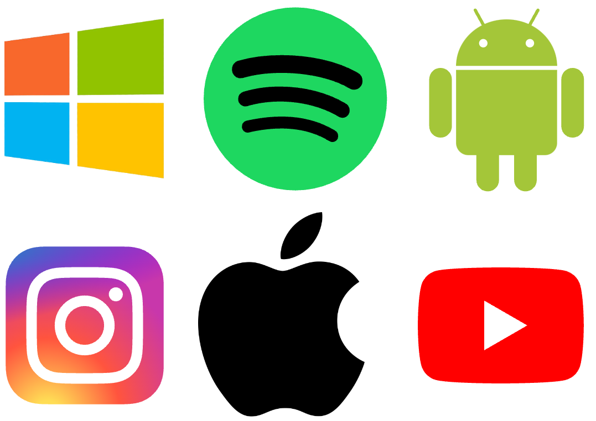

# ⭐️ Zusatzaufgaben
::::aufgabe[Aufgabe 1]
<TaskState id='98676413-9e54-4a6e-b89b-719263ba769b' />
Versuchen Sie mit der Turtle eines (oder mehrere) der folgenden Logos so gut wie möglich nachzuzeichnen.



:::tip[Die richtigen Farben verwenden]
Wenn Sie das Bild herunterladen (__:mdi[cursor-default-click] Rechtskick__ > __Bild speichern unter...__) und es dann in [diesem Tool](https://imagecolorpicker.com/) hochladen, können Sie mit der Maus auf die verschiedenen Bereiche klicken, um die jeweilige Farbe herauszufinden.

Kopieren Sie jeweils den **HEX-Code** heraus (das ist der Wert, der mit einem `#` beginnt).

Den HEX-Code können Sie anschliessend wie eine ganz normale Farbe verwenden. Für den grünen Teil des Windows-Logos wäre das zum Beispiel:
```py
fillcolor('#91c300')
pencolor('#91c300')
```
:::

:::tip[Kreise und Halbkreise]
Schauen Sie sich im [Cheatsheet](../Cheatsheet-Turtle-Befehle) nochmal den Befehl `circle(r, w)` genau an.
:::

```py live_py title=Windows id=831be648-daf5-4201-8e7c-b095710a3a1d
```

```py live_py title=Spotify id=34f1ca3c-296a-4098-b3bd-06b78ce814c7
```

```py live_py title=Android id=93104611-d3be-4306-bcca-d511bb4ddc22
```

```py live_py title=Instagram id=40eea045-2bd3-4c42-bfa3-8e490c7ef6f8
```

```py live_py title=Apple id=1ae5e5e7-ae8c-4cbc-950c-7c06174ff012
```

```py live_py title=YouTube id=c6d3b495-7c82-4b43-94eb-956855349d49
```
::::

::::aufgabe[Eigenes Logo designen]
<TaskState id='9023dfb2-fc0b-4b91-b602-5b2efc95fe01' />
Werden Sie kreativ! Designen Sie auf Papier Ihr eigenes Logo, z.B. für Ihre Klasse, Ihren Sportverein, Ihr Cookie-Business, ...

Zeichnen Sie das Logo anschliessend mit der Turtle nach.

```py live_py title=logo.py id=94fe4d4c-6638-4375-83ef-592b399b56e5
```
::::

::::aufgabe[Labyrinth]
<TaskState id='d52aa33b-19da-4716-be51-9aa97d1e1ca6' />
:mdi[account-supervisor] Suchen Sie sich für diese Aufgabe eine:n Partner:in.

Zeichnen Sie mit der Turtle nun je (unabhängig voneinander) ein möglichst spannendes Labyrinth.


Erstellen Sie anschliessend ein Screenshot vom gezeichneten Labyrinth und senden Sie es ihrer Partner:in. Lösen Sie gegenseitig Ihre Labyrinthe (am besten mit einem digitalen Stift).
```py live_py title=labyrinth.py id=47425f0d-5856-4cb0-931b-06d4114a9193
```
::::
