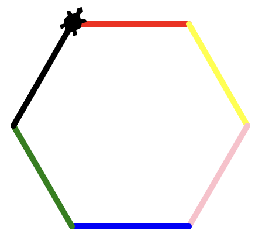
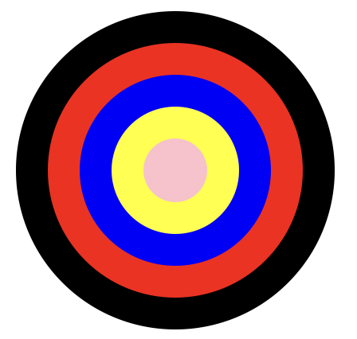
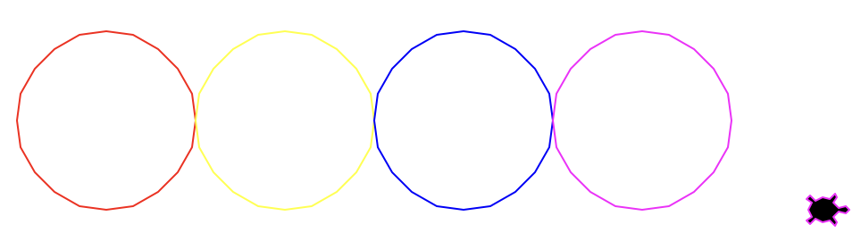
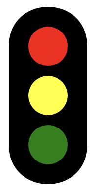
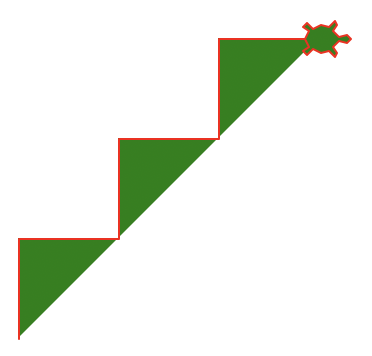
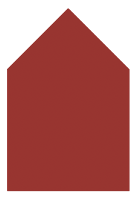
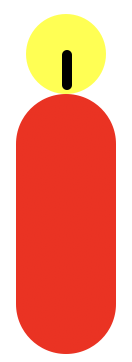
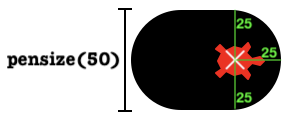
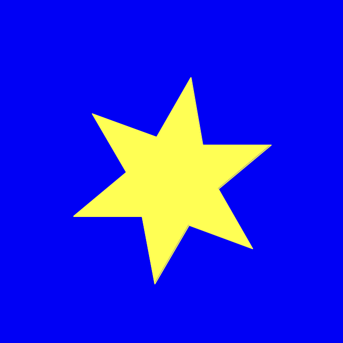

# Farben verwenden 🎨
## Aufgaben
:::tip[Cheatsheet]
Denken Sie auch an das [Cheatsheet](../05-Cheatsheet-Turtle-Befehle/index.mdx) — es wird Ihnen eine Hilfe sein!
:::

::::aufgabe[aufgabe_1.py]
<TaskState id='e4f766e6-33d6-48a0-909d-b70a7bf065fc' />
Zeichnen Sie mit der Turtle ein regelmässiges Sechseck und verwenden Sie dabei für jede Seite eine andere Farbe.



:::tip[pensize(n)]
Mit dem Befehl `pensize(n)` können Sie die Dicke des Stifts verändern, damit die Linien deutlicher zu sehen sind.
:::

```py live_py id=b950e15f-a03d-4ca2-a415-6f871ecf1e0f
```

<Solution id='ff0a3871-503a-4aef-83ab-6539af4aba9a'>
  ```py live_py readonly slim
  from turtle import *

  shape('turtle')

  pensize(5)

  pencolor('red')
  forward(100)
  right(60)

  pencolor('yellow')
  forward(100)
  right(60)

  pencolor('pink')
  forward(100)
  right(60)

  pencolor('blue')
  forward(100)
  right(60)

  pencolor('green')
  forward(100)
  right(60)

  pencolor('black')
  forward(100)

  done()
  ```
</Solution>
::::

:::aufgabe[aufgabe_2.py]
<TaskState id='ab708d63-b24e-40f8-8de4-ee0d0de2a7dc' />
Zeichnen Sie folgende Figur. Am Schluss soll die Turtle nicht mehr sichtbar sein.



```py live_py id=71ed244b-587c-4974-ae0b-92880df701e1
```

<Solution id='7c4300be-130a-41ea-9c9a-5652560a7eae'>
  ```py live_py readonly slim
  from turtle import *

  hideturtle()

  pencolor('black')
  dot(200)

  pencolor('red')
  dot(160)

  pencolor('blue')
  dot(120)

  pencolor('yellow')
  dot(80)

  pencolor('pink')
  dot(40)

  done()
  ```
</Solution>
:::

::::aufgabe[aufgabe_3.py]
<TaskState id='a6854909-031b-45d2-bf23-feff59e96e37' />
Zeichnen Sie solche Kreise mit den Farben `'red'`, `'yellow'`, `'blue'`, `'magenta'`.



Die Kreise sollen einander berühren. Es sollen aber keine zusätzlichen Striche Sichtbar sein (nur die Kreise).

:::tip[back(n)]
Damit die Turtle nicht aus dem Fenster rennt, können Sie sie am Anfang mit dem Befehl `back(n)` etwas nach links bewegen.
:::

```py live_py id=33d294b9-469f-468a-858a-5784091645f1
```

<Solution id='8acc38a2-11cc-4990-9459-3e158a76fdb2'>
  ```py live_py readonly slim
  from turtle import *

  shape('turtle')

  penup()
  back(200)
  pendown()

  pencolor('red')
  circle(50)
  penup()
  forward(100)
  pendown()

  pencolor('yellow')
  circle(50)
  penup()
  forward(100)
  pendown()

  pencolor('blue')
  circle(50)
  penup()
  forward(100)
  pendown()

  pencolor('magenta')
  circle(50)
  penup()
  forward(100)
  pendown()

  done()
  ```
</Solution>
::::

::::aufgabe[aufgabe_4.py]
<TaskState id='3deb2d7a-9f77-4415-a6e3-7dab0892f8b1' />
Zeichnen Sie die folgende Ampel. Die Turtle soll am Schluss nicht zu sehen sein.



:::tip[Hintergrund]
Den schwarzen Hintergrund zeichnen Sie am einfachsten mit `pensize(80)`.
:::

```py live_py id=24b4523c-a9f5-4038-96ae-ba9ab141dd98
```

<Solution id='d7a70e3d-9a32-4f28-8a1f-a6caea279604'>
  ```py live_py readonly slim
  from turtle import *

  hideturtle()

  right(90)
  pensize(80)
  forward(100)
  back(100)

  penup()

  pencolor('red')
  dot(40)

  forward(50)
  pencolor('yellow')
  dot(40)

  forward(50)
  pencolor('green')
  dot(40)

  done()
  ```
</Solution>
::::

::::aufgabe[aufgabe_5.py]
<TaskState id='f2f2f393-72f5-44f4-9e71-160e52cdf91d' />
Zeichnen Sie eine solche Treppe mit rotem Stift und grüner Füllung.



:::tip[Cheatsheet verwenden]
Zum Füllen brauchen Sie die Befehle `begin_fill()`, `fillcolor(...)` und `end_fill()`. Schauen Sie nochmal im [Cheatsheet](../05-Cheatsheet-Turtle-Befehle/index.mdx) nach, wie genau die funktionieren und wie sie zusammenspielen.
:::

:::tip[Hintergrund]
Das Füllen funktioniert auch dann, wenn die Figur eigentlich nicht geschlossen ist. Es gibt quasi eine «imaginäre Linie» zwischen dem Start- und dem Endpunkt der Figur. 

Es kann sein, dass diese Linie automatisch gezeichnet wird, auch wenn sie auf dem Referenzbild nicht zu sehen ist. Es handelt sich dabei lediglich um ein Darstellungs-Detail hier auf Classrooms. Sie können diesen Unterschied ignorieren.
:::

```py live_py id=5feaa5a7-7d26-4438-8e7b-5baead4db229
```

<Solution id='549f5f6d-f50a-4217-ae56-fc0b4e3d71b5'>
  ```py live_py readonly slim
  from turtle import *

  shape('turtle')

  pencolor('red')

  fillcolor('green')
  begin_fill()

  left(90)
  forward(50)
  right(90)
  forward(50)

  left(90)
  forward(50)
  right(90)
  forward(50)

  left(90)
  forward(50)
  right(90)
  forward(50)

  end_fill()

  done()
  ```
</Solution>
::::

::::aufgabe[aufgabe_6.py]
<TaskState id='fc6b0b02-9822-4e3d-9084-aa106120b74b' />
Zeichnen Sie mit der Turtle das untenstehende Haus. Die Turtle soll am Ende nicht sichtbar sein.



```py live_py id=621b355a-a221-4175-b52d-85085c0eb7c9
```

<Solution id='3ae7f0e8-c1dc-43c7-aff3-760f09fdfdbb'>
  ```py live_py readonly slim
  from turtle import *

  shape('turtle')

  pencolor('brown')
  fillcolor('brown')
  begin_fill()

  forward(100)
  left(90)
  forward(100)
  left(45)
  forward(71)
  left(90)
  forward(71)
  left(45)
  forward(100)

  end_fill()

  hideturtle()

  done()
  ```
</Solution>
::::

::::aufgabe[aufgabe_7.py]
<TaskState id='76e02c9d-cc5c-41ac-8150-ef767d166c6c' />
Zeichnen Sie mit der Turtle eine solche Kerze. Die Turtle soll am Ende nicht mehr zu sehen sein.



:::tip[Stiftbreite und -Position]
Der Stift befindet sich genau in der Mitte der Turtle (hier markiert mit dem weissen Kreuz). Mit `pensize(d)` setzen wir die Breite des Stifts auf einen Durchmesser von `d`. Wenn wir also z.B. `pensize(50)` verwenden, dann zeichnet der Stift in einem Radius von `25` rund um die Turtle herum.



<details>
  <summary>Mehr zu diesem Bild...</summary>
  <div>
    Das obige Bild ist mit folgendem Programm entstanden:
    ```py live_py slim
    from turtle import *

    shape('turtle')

    pencolor('black')

    pensize(50)
    forward(25)

    fillcolor('red')
    pencolor('red')

    done()
    ```
  </div>
</details>
:::

```py live_py id=ba75203f-093c-43fd-ba6f-e05ebaf60837
```

<Solution id='7ac2b897-80ce-45c2-b9c5-2a65447da0c6'>
  ```py live_py readonly slim
  from turtle import *

  shape('turtle')

  pencolor('yellow')
  dot(40)

  pencolor('black')
  pensize(5)
  right(90)
  forward(15)

  penup()
  forward(30)
  pendown()

  pencolor('red')
  pensize(50)
  forward(100)

  hideturtle()

  done()
  ```
</Solution>
::::

::::aufgabe[⭐️ aufgabe_8.py]
<TaskState id='aa2a6ac3-2b0e-430d-ba5d-e85ddda5ecaa' />
Zeichnen Sie einen gelben Stern auf einem blauen Hintergrund. Die Turtle soll am Ende nicht mehr zu sehen sein.

Die Berechnungen der benötigten Winkel sind hier etwas anspruchsvoller. Im Zweifelsfall: ausprobieren.



:::tip[Hintergrundfarbe]
Schauen Sie auf dem [Cheatsheet](Cheatsheet-Turtle-Befehle) nach, wie Sie die Hintergrundfarbe ändern können.
:::

```py live_py id=6da0d81c-3208-4e48-8cb0-e19c39e1f86a
```

<Solution id='2639edb8-d895-444e-93d7-90272e3bfcd3'>
  ```py live_py readonly slim
  from turtle import *

  shape('turtle')

  bgcolor('blue')

  pencolor('yellow')
  fillcolor('yellow')
  begin_fill()

  forward(70)
  right(140)
  forward(70)
  left(80)

  forward(70)
  right(140)
  forward(70)
  left(80)

  forward(70)
  right(140)
  forward(70)
  left(80)

  forward(70)
  right(140)
  forward(70)
  left(80)

  forward(70)
  right(140)
  forward(70)
  left(80)

  forward(70)
  right(140)
  forward(70)
  left(80)

  end_fill()

  hideturtle()

  done()
  ```
</Solution>
::::

:::aufgabe[⭐️ aufgabe_9.py]
<TaskState id='5552e939-9d8c-4786-841a-ef79a0f544a9' />
Zeichnen Sie mit der Turtle eine der folgenden Staatsflaggen:


```py live_py id=bcc07952-9630-47e5-b78e-09ca4b0c21ee
```
:::

:::aufgabe[⭐️ Turtle-Befehle kennenlernen]
Sie haben nun bereits einige Befehle aus dem [Cheatsheet](../05-Cheatsheet-Turtle-Befehle/index.mdx) kennengelernt. Es gibt aber immer noch einige Befehle, die Sie bisher nicht verwendet haben.

Gehen Sie nochmal in aller Ruhe durchs Cheatsheet und suchen Sie sich einige Befehle aus, die Sie noch nicht kennen. Probieren Sie diese im Code-Editor unten aus (denken Sie daran, dass das Programm mit `from turtle import *` beginnen muss).

Versuchen Sie auch gleich, bei jedem Befehl direkt im Code kurz zu erklären, was er macht und was da nun passiert. Verwenden Sie dazu das `#`-Zeichen: Alles, was nach einem `#`-Zeichen in einer Zeile steht wird als Kommentar interpretiert und somit nicht ausgeführt. Das `#` kann auch ganz am Anfang der Zeile stehen, wenn die ganze Zeile ein Kommentar sein soll.

Hier ein Beispiel mit einigen Befehlen, die Sie bereits kennen:

```py live_py readonly slim
from turtle import *

# Hier wird mit forward(50) und right(90) zuerst ein Quadrat gezeichnet.
forward(50)
right(90)
forward(50)
right(90)
forward(50)
right(90)
forward(50)
right(90)

# Turtle gegen rechts verschieben, ohne zu zeichnen.
penup()
forward(100)
pendown()

begin_fill() # Mit diesem Befehl sagen, wir, dass ab jetzt eine Figur gezeichnet wird, die am Schluss gefüllt werden soll.
# Nochmal ein Quadrat zeichnen (dieses soll am Schluss gefüllt werden).
forward(50)
right(90)
forward(50)
right(90)
forward(50)
right(90)
forward(50)
right(90)
fillcolor('blue') # Farbe für das Füllen festlegen (brauchen wir, bevor wir end_fill() aufrufen).
end_fill() # Die gezeichnete Figur soll jetzt mit der gesetzten Fill Color gefüllt werden. Dieser Befehl braucht keinen Parameter.
```
:::