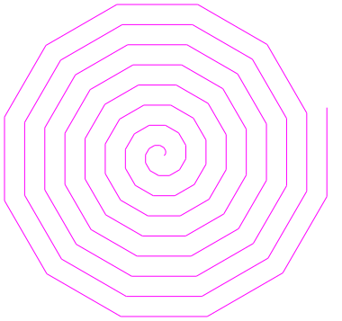
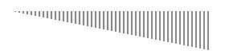
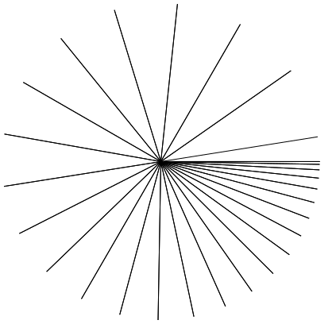
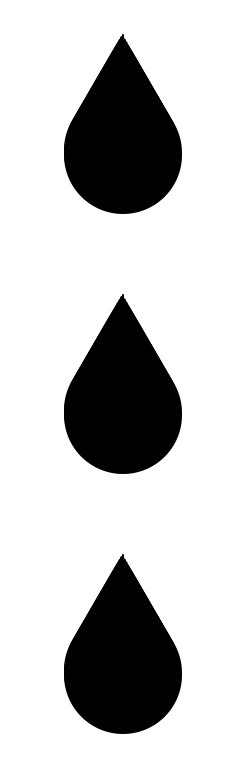

# `for`-Schleife genauer untersuchen
::::aufgabe[Aufgabe 1]
<TaskState id='51c21cfd-b1d1-4e17-aaf1-6982ecd7ced3' />

1. Führen Sie das untenstehende Turtle-Programm **noch nicht aus**. Schauen Sie es sich zuerst genau an. Überlegen Sie sich, was hier wohl gezeichnet werden könnte.
2. Führen Sie das Programm aus. Überlegen Sie, ob das Ergebnis Ihrer Vermutung entspricht.
3. Wie erklären Sie sich das Ergebnis? Halten Sie Ihre Theorie unten im Textfeld fest.
```py live_py readonly slim
from turtle import *

shape('turtle')

for i in range(100):
    forward(i)
    right(90)

done()
```

<QuillV2 id='0b6428a5-f98c-4d03-8c6f-41ba46b3b718' />

<Solution id='c45ab042-a444-41dd-ba34-608bdb5dfb81'>
  Auf Zeile 6 geben wir in den Klammern keine Zahl an, sondern ein `i`. Dieses `i` hat mit dem Start
  der `for`-Schleife auf Zeile 5 zu tun, und wir nennen es den **Schleifenzähler**.
  <br />
  Das funktioniert folgendermassen: Beim ersten Durchlauf der Schleife verhält sich das `i` wie die Zahl
  `0`, beim zweiten Durchlauf verhält es sich wie die Zahl `1`, und so weiter – beim 100-sten Durchlauf
  verhält es sich wie die Zahl `99`.
  <br />
  Wenn wir auf der Zeile 6 also `forward(i)` schreiben, dann ist das beim ersten Durchlauf das gleiche
  wie `forward(0)`, beim zweiten Durchlauf so wie `forward(1)`, ..., und beim 100-sten Durchlauf so
  wie `forward(99)`.
</Solution>
::::

::::aufgabe[Aufgabe 2]
<TaskState id='c9f89310-fbbb-4e52-bee6-543441f510d8' />

Nutzen Sie Ihre Erkenntnisse aus der vorangehenden Aufgabe, um ein Turtle-Programm zu schreiben, das eine solche Spirale zeichnet:



```py live_py id=c5f80934-77bd-412f-a858-c31c6f239d15
```

Halten Sie kurz fest, was hier passiert. Wie schaffen Sie es, dass die Spirale immer grösser wird, ohne dass Ihr Code extrem lang wird?

<QuillV2 id="639e3ced-b9bb-477a-9786-76020341a7a9" />

<Solution id='ab22bde5-2dfa-4a2d-8af9-d614927a305e' title="Code">
  ```py live_py readonly slim
  from turtle import *

  shape('turtle')
  pencolor('magenta')

  for i in range(100):
    forward(i)
    left(30)

  done()
  ```
</Solution>
<Solution id='67f0230c-c4d3-469c-8824-2c8ec9b9d1ea' title="Beobachtung">
Man verwendet für den `forward()`-Befehl keinen festgelegten Wert, sondern das `i` (also `forward(i)`). Der Wert von `i` ist bei der ersten Wiederholung `0`, bei der zweiten `1`, dann `2`, `3`, und so weiter. Dadurch werden die Striche immer länger, wodurch die Spirale wächst.
</Solution>
::::

::::aufgabe[Aufgabe 3]
<TaskState id='c6bcbbb6-b7c7-4488-b2ec-c5416af94ff7' />

Schreiben Sie ein Turtle-Programm, das dieses Muster aus 50 (von links nach rechts) gleichmässig
länger werdenden Strichen zeichnet:



```py live_py id=82f7e281-ca23-499a-9ed0-b3944ad2baeb
```

<Solution id='d721bdb2-67ed-48c3-889d-213e775f5959'>
  ```py live_py readonly slim
  from turtle import *

  shape('turtle')

  for i in range(50):
      right(90)
      forward(i)

      penup()
      back(i)
      left(90)
      forward(5)
      pendown()

  done()
  ```
</Solution>
::::

::::aufgabe[Aufgabe 4]
<TaskState id='b1a2dfa8-0995-4d0f-9263-6c8e3279d5e0' />

Diese Sonne ist ein Bisschen speziell: Sie besteht aus 28 ungleich verteilten Strahlen. Der erste Strahl geht von der Mitte aus horizontal gegen rechts. Je weiter wir uns dann im Uhrzeigersinn drehen, desto weiter sind die Strahlen voneinander entfernt.

Schreiben Sie ein Turtle-Programm, dass diese Sonne nachzeichnet. Die Turtle soll am Schluss nicht mehr zu sehen sein.



```py live_py id=5e4db641-92d7-4204-8e2c-c61a4b3803e4
```

<Solution id='0bb94ed3-c862-4149-91ee-74b956258b2f'>
  ```py live_py readonly slim
  from turtle import *

  shape('turtle')
  speed(9)

  for i in range(28):
      goto(0, 0)
      forward(200)
      right(i)

  hideturtle()
  done()
  ```
</Solution>
::::

::::aufgabe[⭐️ Aufgabe 5]
<TaskState id='4c91e66a-b60c-4d28-9a51-4de6b6d4cfa4' />

Schreiben Sie ein Turtle-Programm, das drei solche Wassertropfen untereinander zeichnet. Die Turtle soll am Schluss nicht mehr zu sehen sein. Die ganze Zeichnung soll im Turtle-Fenster sichtbar sein.



```py live_py id=d27e8b1b-8c5c-47b0-b59b-26861a53cb22
```

<Solution id='1aa64cf9-096e-475f-89b9-af39314bf155'>
  ```py live_py readonly slim
  from turtle import *

  shape('turtle')

  right(90)
  penup()
  back(200)

  for i in range(3):
      pendown()
      for i in range(60):
          pensize(i)
          forward(1)

      penup()
      forward(70)

  hideturtle()
  done()
  ```
</Solution>
::::
