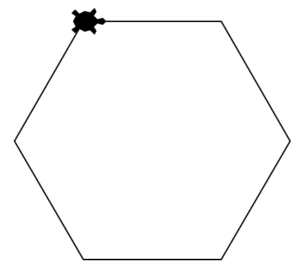
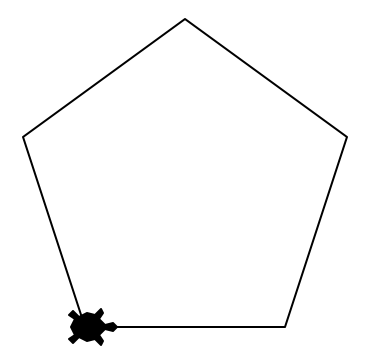
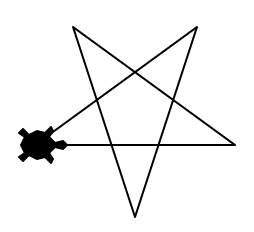
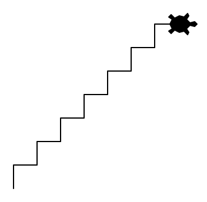
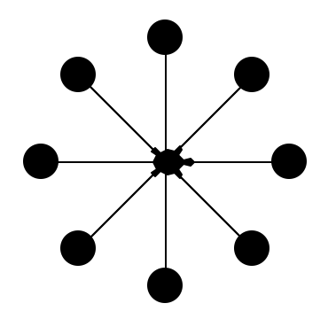
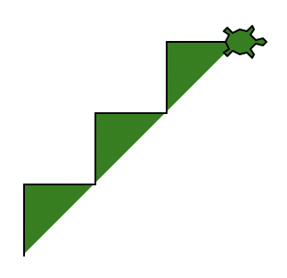
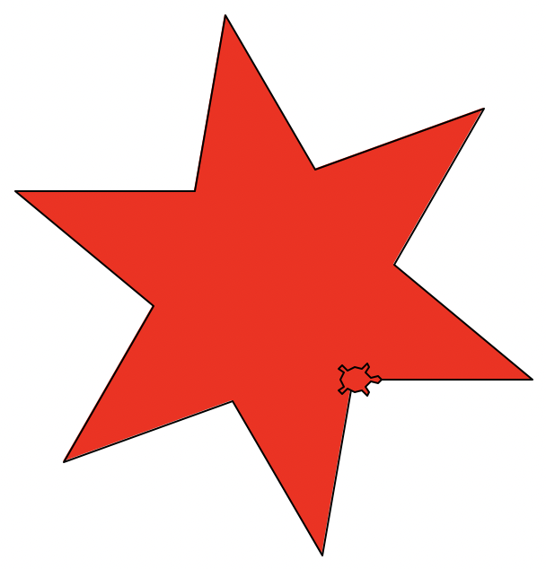
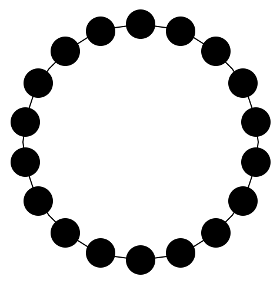
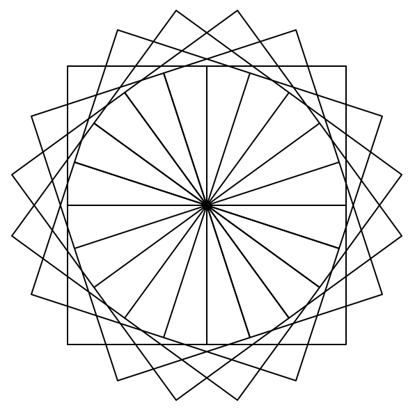
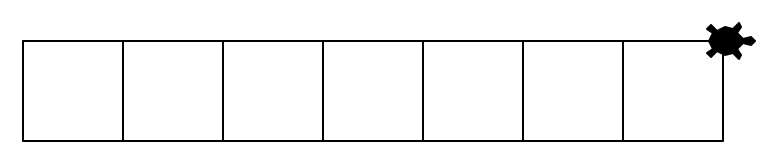

import Steps from '@tdev-components/Steps'

# Wiederholung 🔁
Die **Wiederholung** (auch als **Schleife** bezeichnet) ist eine der wichtigsten Kontrollstrukturen zur Erstellung von Algorithmen. Mit ihr können wir eine repetitive _Sequenz_ von Befehlen 1x aufschreiben und beliebig oft wiederholen lassen, statt sie mehrfach aufschreiben zu müssen.

Sie kennen bisher folgende Kontrollstrukturen:
| Kontrollstruktur | Beschreibung |
| -- | -- |
| Sequenz | Abfolge von Befehlen, die nach und nach ausgeführt werden |
| **Wiederholung (Schleife)** 🔁 | Eine bestimmte Sequenz wird wiederholt (bestimmte Anzahl Mal, oder bis eine Abbruchbedingung eintritt) |

Bei der Schoggi-Schatzsuche stand Ihnen nur die _Sequenz_ als Kontrollstruktur zur Verfügung. Die _Wiederholung_ wäre aber auch nützlich gewesen:

:::flex
**Ohne Wiederholung (wie im Original-Spiel):**
```text showLineNumbers
Links
Links
Links
Schritt
Schritt
Schritt
Schritt
Schritt
Schritt
Schritt
Links
Schritt
Links
Schritt
Schritt
Schritt
```
::br
**Mit Wiederholung (neu):**
```text showLineNumbers
Wiederhole 3x:
    Links
Wiederhole 7x:
    Schritt
Links
Schritt
Links
Wiederhole 3x:
    Schritt
```
:::

Im obigen Beispiel enthält jede Wiederholung immer nur einen Befehl (`Schritt` oder `Links`). Wir können aber auch eine ganze _Sequenz_ wiederholen lassen – hier z.B. für ein Zickzack-Muster:

:::flex
**Zickzack-Muster, 3 «Stufen», ohne Wiederholung:**
```text showLineNumbers {1-6}
Schritt
Links
Schritt
Links
Links
Links
Schritt
Links
Schritt
Links
Links
Links
Schritt
Links
Schritt
Links
Links
Links
```
::br
**Zickzack-Muster, 3 «Stufen», mit Wiederholung:**
```text showLineNumbers {2-7}
Wiederhole 3x:
    Schritt
    Links
    Schritt
    Links
    Links
    Links
```
:::

:::insight[Trotzdem noch repetitive Anweisungen]
Im rechten Beispiel (Zickzackmuster mit Wiederholung) notieren wir 1x die Sequenz für eine «Stufe» des Zickzack-Musters: und lassen diese dann 3x wiederholen. Diese Sequenz, die wir wiederholen lassen, enthält selbst aber auch noch repetitive Befehle (es steht am Schluss 3x hintereinander `Schritt`, siehe Zeilen 5-7 im Beispiel rechts). Wie man dieses Problem lösen kann, erfahren Sie weiter unten.
:::

Das Verwenden einer **Wiederholung** hat mehrere Vorteile:
Kürzerer Code
: Durch das Zusammenfassen repetitiver Anweisungen wird der Code kürzer.
Weniger Fehler
: Beim Aufschreiben repetitiver Anweisungen passieren schnell Fehler, die man mit der Wiederholung vermeiden kann. **Achtung:** Während der Mensch auch bei Ausführen Fehler machen kann, passiert dies dem Computer nicht.
Einfache Anpassung
: Falls wir Befehle mit Zusatzinformationen (sog. _Parametern_) verwenden (z.B. `forward(50)`) müssen wir auch diese Zusatzinformation immer hinschreiben. Möchten wir nun z.B. beim Zeichnen eines Turtle-Quadrats die Seitenlänge von `50` auf `100` ändern, müssen wir die Zahl bei jedem `forward(…)`-Befehl (also 4x) anpassen. Das ist aufwändig und fehleranfällig. Wenn wir eine Wiederholung verwenden, haben wir nur noch einen `forward(…)`-Befehl und müssen somit nur eine Anpassung machen.

## Die `for`-Schleife in Python
**Zur Erinnerung:** Programmieren heisst, einen Algorithmus in die Sprache des Computers zu übersetzen. Wir brauchen also eine Möglichkeit, das algorithmische Konzept einer _Wiederholung_ auch in Python auszudrücken. Python bietet uns dazu verschiedene Möglichkeiten – am häufigsten Arbeiten wir aber mit der `for`-Schleife.

Ein Turtle-Quadrat können wir damit beispielsweise so zeichnen:

```py live_py slim
from turtle import *

shape('turtle')

for i in range(4):
    forward(50)
    right(90)

done()
```

Für den Moment lesen wir das `range(4)` dabei einfach als «4-mal». Mit den `i` beschäftigen Sie sich im nächsten Kapitel. Das ganze Zeile `for i in range(4):` können Sie also für den Moment einfach als «Wiederhole die folgenden eingerückten Anweisungen 4-mal» verstehen:


wobei Sie die Anzahl der Wiederholungen natürlich an die entsprechende Situation und Aufgabe anpassen können, indem Sie die Zahl `4` in Klammern durch eine andere Zahl ersetzen.

:::insight[Einfache Anpassung]
Das obige Beispiel macht deutlich, weshalb die Wiederholung dafür sorgt, dass unser Code einfach anpassbar wird: Wenn Sie beim obigen Quadrat die Seitenlänge von `50` auf `100` verändern wollen, müssen Sie nur die Zahl auf Zeile `6` verändern: `forward(50)` wird zu `forward(100)`.
:::

## Übungen
::::aufgabe[Aufgabe 1]
<TaskState id='6626be46-3a3f-4333-b430-b391810f93ea' />
Verwenden Sie eine **Schleife**, um mit der Turtle ein regelmässiges Sechseck mit Seitenlänge `100` zu zeichnen.

:::tip[Zeilen]
Ihre Lösung sollte aus maximal 6 Zeilen bestehen (Leerzeilen nicht mitgezählt).
:::



```py live_py title=aufgabe__1.py id=ff359f8a-5d40-413d-85a0-358cebaf9764
```

<Solution id='2c49c107-8e7c-4c00-b887-62db227a381c'>
  ```py live_py slim
  from turtle import *

  shape('turtle')

  for i in range(6):
      forward(100)
      right(60)

  done()
  ```
</Solution>
::::

::::aufgabe[Aufgabe 2]
<TaskState id='e34093fd-5539-4bd0-bb46-5830feb29fa3' />
Kopieren Sie das Programm aus der vorherigen Aufgabe und experimentieren Sie mit der Anzahl Wiederholungen und den Drehwinkeln (dazu gehören auch `left(n)` vs. `right(n)`) um die folgenden beiden Figuren zu zeichnen:

:::cards{gap="1em" marginBottom="1em" width="100%"}

::br

:::

```py live_py title=aufgabe__2__pentagon.py id=3c8e13eb-c393-4a97-828f-6dfa2042ab63
```

```py live_py title=aufgabe__2__stern.py id=93885afe-dcae-4ca7-b791-3552ad0d3555
```

<Solution id='7361766d-9673-45b6-bf8b-3d61ef030223'>
  **Pentagon (Fünfeck):**
  ```py live_py slim
  from turtle import *

  shape('turtle')

  for i in range(5):
      forward(100)
      left(72)

  done()
  ```

  **Stern:**
  ```py live_py slim
  from turtle import *

  shape('turtle')

  for i in range(5):
      forward(100)
      left(144)

  done()
  ```
</Solution>
::::

::::aufgabe[Aufgabe 3]
<TaskState id='6fdebf9e-64cd-454e-88f5-3e1aa7b661ab' />
Verwenden Sie eine **Schleife** um eine Treppe mit 7 Stufen zu zeichnen. Die Stufen sollen je 20 Pixel hoch und tief sein.



```py live_py title=aufgabe__3.py id=9b649f7a-3857-408f-8877-b0a9982433e2
```

**Verständnisfrage:** Auf wie vielen Codezeilen müssen Sie etwas ändern, wenn Sie statt 7 neu 25 Stufen möchten? Geben Sie Ihre Antwort hier als Zahl ein und überprüfen Sie sie mit einem Klick auf den :mdi[help-circle-outline]-Button.

<String id="5d463b1f-f941-424a-af89-7441bf8d78b9" label="Antwort" placeholder="Antwort als Zahl..." solution="1" sanitizer={val => val.trim()} />

<Solution id='7d986a2c-305e-4a1f-9994-da4e9f418a67'>
  ```py live_py slim
  from turtle import *

  shape('turtle')

  for i in range(7):
      left(90)
      forward(20)
      right(90)
      forward(20)

  done()
  ```
</Solution>
::::

::::aufgabe[Aufgabe 4]
<TaskState id='2e851fb5-f413-4982-9c33-e3de7623bd34' />
Verwenden Sie eine Schleife, um die folgende Figur zu zeichnen:



```py live_py title=aufgabe__4.py id=c82fad50-5016-4b35-8fae-3146a5f4d116
```

<Solution id='4ca08601-2fd4-4c7a-ae33-30b53c96e070'>
  ```py live_py slim
  from turtle import *

  shape('turtle')

  for i in range(8):
      forward(70)
      dot(20)
      back(70)
      right(360/8)

  done()
  ```
</Solution>
::::

::::aufgabe[Aufgabe 5]
<TaskState id='d0ce8e29-7e8d-45c0-b4ca-1d1f52ec583f' />
Verwenden Sie eine Schleife, um diese Treppe zu zeichnen:



```py live_py title=aufgabe__5.py id=8bc71413-5547-4c52-93d9-09596d4bfc44
```

<Solution id='91852a92-f2f9-4b91-b8c1-d37e49f2cea9'>
  ```py live_py slim
  from turtle import *

  shape('turtle')
  fillcolor('green')

  begin_fill()
  for i in range(3):
      left(90)
      forward(40)
      right(90)
      forward(40)
  end_fill()

  done()
  ```
</Solution>
::::

::::aufgabe[Aufgabe 6]
<TaskState id='3b6bbc6d-a0d9-4846-b74a-4c8f9cc8f89b' />
Verwenden Sie eine Schleife, um diesen Stern zu zeichnen:



```py live_py title=aufgabe__6.py id=bead9f5d-e43c-45be-ad05-e8cd3565e129
```

<Solution id='2a4fe953-927f-4d71-9326-6ee76a50d8bc'>
  ```py live_py slim
  from turtle import *

  shape('turtle')

  fillcolor('red')

  begin_fill()
  for i in range(6):
      forward(100)
      left(140)
      forward(100)
      right(80)
  end_fill()

  done()
  ```
</Solution>
::::


::::aufgabe[Aufgabe 7]
<TaskState id='22260b22-0100-4cb5-a04a-de80bb179c2a' />
Zeichnen Sie mit der Turtle eine solche Perlenkette mit 18 Perlen. Die Turtle soll am Schluss nicht mehr zu sehen sein.



```py live_py title=aufgabe__7.py id=999b2aed-35a6-4c48-9bae-5fc3b33f459c
```

<Solution id='665be296-17fc-42b4-b480-2b6fea3e7090'>
  ```py live_py slim
  from turtle import *

  shape('turtle')

  circle(100)
  penup()

  left(90)
  forward(100)

  for i in range(18):
      forward(100)
      dot(25)
      back(100)
      left(360/18)

  hideturtle()
  done()
  ```
</Solution>
::::

## Verschachtelte Schleifen
Das Beispiel mit dem Zickzack-Muster ist mit der Wiederholung schon deutlich besser geworden. In der wiederholten Sequenz hat es aber immer noch einen repetitiven Befehl drin (am Schluss steht zweimal nacheinander `Links`). Das können wir noch optimieren, indem wir eine Wiederholung innerhalb einer Wiederholung verwenden (Variante 2, Zeilen 6-7):

:::flex
**Variante 1:**
```text showLineNumbers {6,7}
Wiederhole 3x:
    Schritt
    Links
    Schritt
    Links
    Links
    Links
```
::br
**Variante 2:**
```text showLineNumbers {6,7}
Wiederhole 3x:
    Schritt
    Links
    Schritt
    Links
    Wiederhole 2x:
        Links
```
:::

Das Ergebnis ist eine sogenannte **verschachtelte** Wiederholung. Dabei haben wir immer eine **innere** und eine **äussere** Wiederholung: Die innere Wiederholung ist die auf den Zeilen 6-7, die äussere ist die auf den Zeilen 1-7. **Das Ausführen der inneren Wiederholung ist Teil der Sequenz der äusseren Wiederholung.** Die innere Wiederholung ist also quasi ein «Schritt» der äusseren Wiederholung.


:::insight[Beliebige Verschachtlung]
Wiederholungen können grundsätzlich beliebig tief verschachtelt werden: Auch die innere Wiederholung kann selbst wieder eine innere Wiederholung enthalten, die selbst auch wiederum eine innere Wiederholung enthält, und so weiter.
:::

::::aufgabe[Aufgabe 8]
<TaskState id='e43987c5-dfdc-42ec-9535-73c50811e1a7' />
<Steps>
1. Analysieren Sie das untenstehende Programm. Versuchen Sie auf einem Blatt Papier herauszufinden, was hier gezeichnet wird.
2. Machen Sie mit der **Laptop**-Webcam ein Foto von Ihrer Zeichnung und fügen Sie es hier ein:
   <QuillV2 id="de370984-4214-4b0c-8c3f-7f3467114f0c" />
3. Kopieren Sie den Code anschliessend unten in den Code Editor und führen Sie das Programm aus, um Ihre Vermutung zu überprüfen.
</Steps>

```py
from turtle import *

shape('turtle')

for i in range(5):
    for i in range(4):
        forward(100)
        right(90)
    left(36)

done()
```

```py live_py slim

```
::::

::::aufgabe[Aufgabe 9]
<TaskState id='ddecd954-dd80-4bea-a5e8-1459d70d5a31' />
Wie man mit einer Schleife ein Quadrat zeichnet, wissen Sie bereits. Nun sollen Sie folgendes Bild zeichnen, welches aus 20 Quadraten (je mit einer Seitenlänge von `100`) besteht, die je 18° zueinander verdreht sind.

Verwenden Sie dazu zwei ineinander **verschachtelte** `for`-Schleifen: also eine `for`-Schleife **innerhalb einer anderen** `for`-Schleife.



```py live_py title=aufgabe__9.py id=36db9832-2c83-4de5-a110-f6a55220fc8c
```

<Solution id='dad189e1-9478-40d7-a4dd-60c7ee901745'>
  ```py live_py slim
  from turtle import *

  shape('turtle')

  for i in range(20):
      for i in range(4):
          forward(100)
          right(90)
      left(18)

  hideturtle()
  done()
  ```
</Solution>
::::

::::aufgabe[Aufgabe 10]
<TaskState id='7a5a50c7-26fe-4366-b056-026749628e3d' />
Zeichnen Sie die folgende Figur wiederum mit zwei ineinander verschachtelten `for`-Schleifen. Die innere `for`-Schleife zeichnet ein Quadrat.



:::tip[Turtle im Feld behalten]
Gehen Sie mit der Turtle zuerst ein bisschen zurück, damit sie nicht aus dem Fenster rennt. Verwenden Sie dazu die Befehle `back()`, `penup()` und `pendown()`.
:::

```py live_py title=aufgabe__10.py id=1aa3bc18-b8c1-4525-a612-9d09c5bff4ba
```

<Solution id='07daedcf-7d26-46b4-90dd-440100650dcc'>
  ```py live_py slim
  from turtle import *

  shape('turtle')

  penup()
  back(200)
  pendown()

  for i in range(7):
      for i in range(4):
          forward(50)
          right(90)
      forward(50)

  done()
  ```
</Solution>
::::
