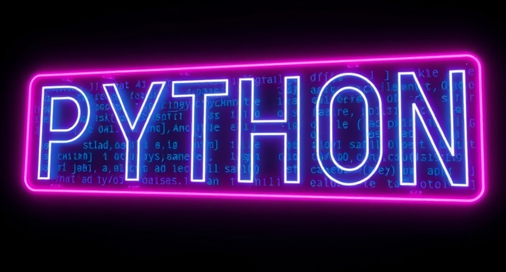

import SlidesLink from "@tdev-components/LinkButton/SlidesLink"

# Programmieren

In diesem Themenbereich beschäftigen wir uns mit Algorithmen und mit den Grundlagen der Programmierung in Python.

<SlidesLink url="https://erzbe-my.sharepoint.com/:f:/g/personal/silas_berger_gbsl_ch/IgBYKziIIp4GT4aJiZs_6fVzAWxeDTQL3RS9JfEsqhIhjGQ?e=XNUgwf" />

## Kurztest
Die Lernziele und Prüfungsinformationen werden zu einem späteren Zeitpunkt hier bekanntgegeben.

## Abschlusstest
Die Lernziele und Prüfungsinformationen werden zu einem späteren Zeitpunkt hier bekanntgegeben.